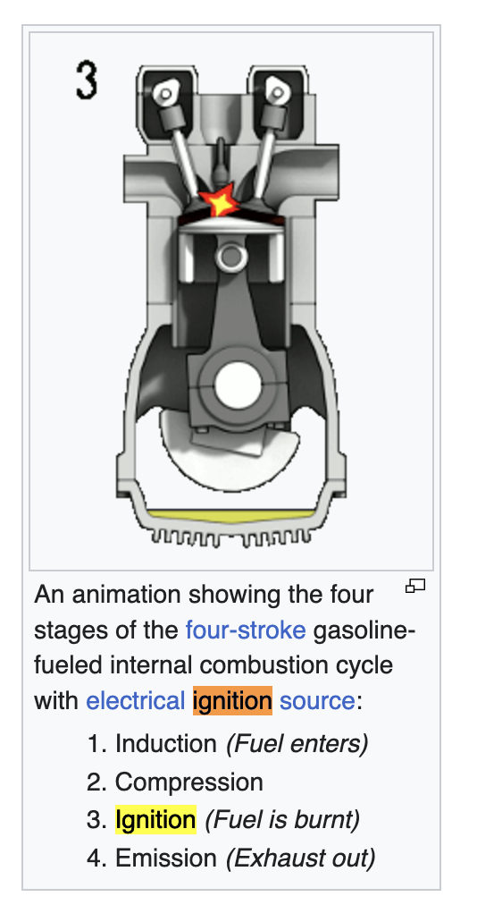

## Basics.

- torque: a force that causes something to rotate (= turn in a circle), or the moment of force.
- Power is the amount of energy transferred or converted per unit time.

The process of engine is as follows.

The process of transform happens in ignition. The energy in oil is transformed into gas.

| 门店        | 裸车优惠   |  装饰 + 保养 + 延保  | 归一化 |
| :--------  | :-----  | :----:  | :----:  | 
| 大兴 - 金冠| 14w|11800 (2A + 2B)| 13.5w + 6800(2A + 2B) | 
|亦庄 - 运通 | 14.2w| 12000(6A + 6B) | 13.5w + 5000(6A + 6B) |
| 亦庄 - 利行之星(马驹桥) | 13.3w | 8800(2A + 2B) | 13.5w + 9000(2A + 2B) |
| 通州 - 波士 | 13.5w| 3000(3A) | 13.5W + 3000(3A)
|  朝阳 - 中星 |  ||
| 丰台 - 鹏龙大道 | | |

- 税 = 裸车 / 11.3
- 保险 = 自己买，多退少补，这个就不算车价了
- 上牌 = 1000 - 2000不等
- 利息
  - 总额：33w
  - 一年提前还，需要确定好是否需要违约金。
  - 4.4%: 14520
  - 4.6%: 15180
  - 4.8%: 15840
