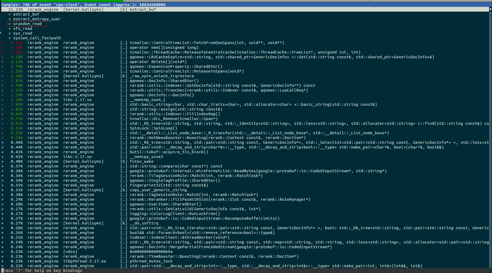

### 一个性能问题

以下代码来自于我们线上的一个真实场景，背景是希望每次获得一个随机槽位。我们采用了c++11的random_device/default_random_engine，但是发现性能非常差
```cpp
bool SlotManager::GetLegalPos(const Slot& slot, int* fpos) {
  // ...
  std::random_device ran_dev;
  std::default_random_engine generator{ran_dev()};
  std::uniform_int_distribution<int> distribution(start, end);
  // ...
}
```

于是我们进一步查看了程序运行时的perf，看看是否能获得一些线索



我们发现
- extract_buf占据了大量cpu时间
- 其中，urandom_read引起了我们的注意，因为我们的代码里面确实使用了随机数。
代码里使用的方式是局部变量的方式，所以猜测会不会是因为对这些随机对象的开销并不了解，而频繁的开辟/销毁带来了较多的时间损耗。我们朝着这个方向继续排查

[/dev/random Extremely Slow?](https://stackoverflow.com/questions/4819359/dev-random-extremely-slow)从这篇文章里我们可以知道，Hardware numbers(/dev/urandom ) are disappointingly slow.<br>
[How do I generate thread-safe uniform random numbers?](https://stackoverflow.com/questions/21237905/how-do-i-generate-thread-safe-uniform-random-numbers) 这篇文章里明确告诉我们default_random_engine有相对重的开销，而distribution的开销则较小。

所以，最终确定random_device局部变量的使用方式，会造成频繁的urandom read，这个是造成该函数耗时显著异常较大的主要原因

解决的思路也非常简单，我们重新分析了这里的逻辑，对于随机化种子，没有必要每一次请求都进行初始化，这应该是线程函数开始初始化一次即可(这里要思考为什么不是服务一开始初始化一次？)
修改后的代码如下：

```cpp
bool SlotManager::GetLegalPos(const Slot& slot, int* fpos) {
  // ...
  thread_local std::random_device ran_dev;  // heavy
  thread_local std::default_random_engine generator{ran_dev()};  // heavy
  std::uniform_int_distribution<int> distribution(start, end);   // light
  // ...
}
```
重新上线后，我们发现之前出现的/dev/urandom 频繁读的现象已经没有了，同时主调耗时下降了15ms.

这里我们进一步思考，既然Hardware numbers(/dev/urandom)的开销不小，为什么我们还要用这种方式来产生随机数呢？简单来说，这种方式是通过收集机器噪音来扩充熵池，从而产生质量较高，安全性较好的伪随机数。同时，distribution类函数保证了分布的正确性。

### thread_local引入

thread_local是storage class specifiers的一种，后者的作用如下：
>they control two independent properties of the name: its storage duration and its linkage.

下面详细介绍Storage duration

All objects in a program have one of the following storage durations:
- automatic storage duration. The storage for the object is allocated at the beginning of the enclosing code block and deallocated at the end. All local objects have this storage duration, except those declared static, extern or thread_local.
- static storage duration. The storage for the object is allocated when the program begins and deallocated when the program ends. Only one instance of the object exists. All objects declared at namespace scope (including global namespace) have this storage duration, plus those declared with static or extern. See Non-local variables and Static local variables for details on initialization of objects with this storage duration.
- thread storage duration. The storage for the object is allocated when the thread begins and deallocated when the thread ends. Each thread has its own instance of the object. Only objects declared thread_local have this storage duration. thread_local can appear together with static or extern to adjust linkage. See Non-local variables and Static local variables for details on initialization of objects with this storage duration.
(since C++11)
- dynamic storage duration. The storage for the object is allocated and deallocated upon request by using dynamic memory allocation functions. See new-expression for details on initialization of objects with this storage duration.

这里需要特别引起注意的是，storage duration和memory space有着严格的对应关系，一种storage duration决定了一种memory space，后者非常重要的原因在于一个变量的memory space直接影响其在多线程编程时是否需要加锁。

下面我们给出一段测试代码，看看thread_local symbol的memory space
```cpp
int g_init_var = 8; // .data OBJECT
int g_uint_var;     // .bss  OBJECT

thread_local int g_init_thread_var = 32;  // .tdata TLS
thread_local int g_uinit_thread_var;      // .tbss  TLS

void auto_test() {
  int var = 2;
}

void thread_local_test() {
  thread_local int t_init_var = 16;  // .tdata TLS
  thread_local int t_uinit_var;      // .tbss  TLS
}

void static_test() {
  static int s_init_var = 32;  // .data OJBECT
  static int s_uinit_var;      // .bss  OBJECT

  static thread_local int s_init_thread_var = 32;  // .tdata TLS
  static thread_local int s_uinit_thread_var;      // .tbss  TLS
}

void dynamic_test() {
  int* h_var = new int(128);
  delete h_var;
}
```

执行命令```g++ -c storage.cc```，得到object文件，然后我们使用readelf命令进行分析(gcc version 7.3.1 20180303 (Red Hat 7.3.1-6) (GCC) )

```
ELF Header:
  Magic:   7f 45 4c 46 02 01 01 00 00 00 00 00 00 00 00 00 
  Class:                             ELF64
  Data:                              2's complement, little endian
  Version:                           1 (current)
  OS/ABI:                            UNIX - System V
  ABI Version:                       0
  Type:                              REL (Relocatable file)
  Machine:                           Advanced Micro Devices X86-64
  Version:                           0x1
  Entry point address:               0x0
  Start of program headers:          0 (bytes into file)
  Start of section headers:          1608 (bytes into file)
  Flags:                             0x0
  Size of this header:               64 (bytes)
  Size of program headers:           0 (bytes)
  Number of program headers:         0
  Size of section headers:           64 (bytes)
  Number of section headers:         14
  Section header string table index: 13

Section Headers:
  [Nr] Name              Type             Address           Offset
       Size              EntSize          Flags  Link  Info  Align
  [ 0]                   NULL             0000000000000000  00000000
       0000000000000000  0000000000000000           0     0     0
  [ 1] .text             PROGBITS         0000000000000000  00000040
       000000000000004c  0000000000000000  AX       0     0     1
  [ 2] .rela.text        RELA             0000000000000000  00000550
       0000000000000030  0000000000000018   I      11     1     8
  [ 3] .data             PROGBITS         0000000000000000  0000008c
       0000000000000008  0000000000000000  WA       0     0     4
  [ 4] .bss              NOBITS           0000000000000000  00000094
       0000000000000008  0000000000000000  WA       0     0     4
  [ 5] .tdata            PROGBITS         0000000000000000  00000094
       000000000000000c  0000000000000000 WAT       0     0     4
  [ 6] .tbss             NOBITS           0000000000000000  000000a0
       000000000000000c  0000000000000000 WAT       0     0     4
  [ 7] .comment          PROGBITS         0000000000000000  000000a0
       000000000000002d  0000000000000001  MS       0     0     1
  [ 8] .note.GNU-stack   PROGBITS         0000000000000000  000000cd
       0000000000000000  0000000000000000           0     0     1
  [ 9] .eh_frame         PROGBITS         0000000000000000  000000d0
       0000000000000098  0000000000000000   A       0     0     8
  [10] .rela.eh_frame    RELA             0000000000000000  00000580
       0000000000000060  0000000000000018   I      11     9     8
  [11] .symtab           SYMTAB           0000000000000000  00000168
       0000000000000270  0000000000000018          12    16     8
  [12] .strtab           STRTAB           0000000000000000  000003d8
       0000000000000171  0000000000000000           0     0     1
  [13] .shstrtab         STRTAB           0000000000000000  000005e0
       0000000000000066  0000000000000000           0     0     1
Key to Flags:
  W (write), A (alloc), X (execute), M (merge), S (strings), I (info),
  L (link order), O (extra OS processing required), G (group), T (TLS),
  C (compressed), x (unknown), o (OS specific), E (exclude),
  l (large), p (processor specific)

There are no section groups in this file.

There are no program headers in this file.

Relocation section '.rela.text' at offset 0x550 contains 2 entries:
  Offset          Info           Type           Sym. Value    Sym. Name + Addend
00000000002a  001800000002 R_X86_64_PC32     0000000000000000 _Znwm - 4
000000000045  001900000002 R_X86_64_PC32     0000000000000000 _ZdlPvm - 4

Relocation section '.rela.eh_frame' at offset 0x580 contains 4 entries:
  Offset          Info           Type           Sym. Value    Sym. Name + Addend
000000000020  000200000002 R_X86_64_PC32     0000000000000000 .text + 0
000000000040  000200000002 R_X86_64_PC32     0000000000000000 .text + e
000000000060  000200000002 R_X86_64_PC32     0000000000000000 .text + 15
000000000080  000200000002 R_X86_64_PC32     0000000000000000 .text + 1c

The decoding of unwind sections for machine type Advanced Micro Devices X86-64 is not currently supported.

Symbol table '.symtab' contains 26 entries:
   Num:    Value          Size Type    Bind   Vis      Ndx Name
     0: 0000000000000000     0 NOTYPE  LOCAL  DEFAULT  UND 
     1: 0000000000000000     0 FILE    LOCAL  DEFAULT  ABS main.cc
     2: 0000000000000000     0 SECTION LOCAL  DEFAULT    1 
     3: 0000000000000000     0 SECTION LOCAL  DEFAULT    3 
     4: 0000000000000000     0 SECTION LOCAL  DEFAULT    4 
     5: 0000000000000000     0 SECTION LOCAL  DEFAULT    5 
     6: 0000000000000000     0 SECTION LOCAL  DEFAULT    6 
     7: 0000000000000004     4 TLS     LOCAL  DEFAULT    5 _ZZ17thread_local_testvE1
     8: 0000000000000004     4 TLS     LOCAL  DEFAULT    6 _ZZ17thread_local_testvE1
     9: 0000000000000004     4 OBJECT  LOCAL  DEFAULT    3 _ZZ11static_testvE10s_ini
    10: 0000000000000004     4 OBJECT  LOCAL  DEFAULT    4 _ZZ11static_testvE11s_uin
    11: 0000000000000008     4 TLS     LOCAL  DEFAULT    5 _ZZ11static_testvE17s_ini
    12: 0000000000000008     4 TLS     LOCAL  DEFAULT    6 _ZZ11static_testvE18s_uin
    13: 0000000000000000     0 SECTION LOCAL  DEFAULT    8 
    14: 0000000000000000     0 SECTION LOCAL  DEFAULT    9 
    15: 0000000000000000     0 SECTION LOCAL  DEFAULT    7 
    16: 0000000000000000     4 OBJECT  GLOBAL DEFAULT    3 g_init_var
    17: 0000000000000000     4 OBJECT  GLOBAL DEFAULT    4 g_uint_var
    18: 0000000000000000     4 TLS     GLOBAL DEFAULT    5 g_init_thread_var
    19: 0000000000000000     4 TLS     GLOBAL DEFAULT    6 g_uinit_thread_var
    20: 0000000000000000    14 FUNC    GLOBAL DEFAULT    1 _Z9auto_testv
    21: 000000000000000e     7 FUNC    GLOBAL DEFAULT    1 _Z17thread_local_testv
    22: 0000000000000015     7 FUNC    GLOBAL DEFAULT    1 _Z11static_testv
    23: 000000000000001c    48 FUNC    GLOBAL DEFAULT    1 _Z12dynamic_testv
    24: 0000000000000000     0 NOTYPE  GLOBAL DEFAULT  UND _Znwm
    25: 0000000000000000     0 NOTYPE  GLOBAL DEFAULT  UND _ZdlPvm

No version information found in this file.
```
我们可以得到如下结论:
- thread_local有自己单独的memory space，即.tdata/.tbss类比.data/.bss
- local static thread_local == local thread_local
  - static和thread_local同时修饰一个变量时，storage duration只能是thread_local
  - 对于局部变量，static无法修饰linkage，所以此时static thread_local == thread_local

但是对于.tdata/.tbss编译器具体存储在哪里，这个还不确定。原因是，单独设立这样一个段for tls这没有问题，但是不代表它不能放在线程栈上。线程栈也可以划分为.tdata/.tbss/run time/auto obj
根据km上的问题，我们其实是知道thread_local会挤占线程栈空间，但是对于windows的实现，这里还不确定.

### 换一个视角

- static storage duration: process local(Each process has its own instance of the object)
- thread_local storage duration: thread local(Each thread has its own instance of the object)
- fiber_local storage duration: fiber local(Each fiber has its own instance of the object)
- automatic storage duration: block local(Each block has its own instance of the object)

上面主要是一个并发编程的视角，很容易理解各类变量的线程安全/协程安全。比如，一个process-local变量，显然不是thread-safe。同理，一个thread-local变量也不是fiber-safe.
所以我们在进行并发编程的时候，可以从storage duration/memory space的角度来理解什么时候需要加锁来保护内部对象的状态，什么时候不需要

### 一个简单的demo

```cpp
#include <iostream>
#include <mutex>
#include <string>
#include <thread>

thread_local int counter = 0;
std::mutex cout_mtx;

void foo(const std::string& tname) {
  ++counter;

  std::lock_guard<std::mutex> lock(cout_mtx);
  std::cout << "tname:" << tname << ", counter:" << counter << std::endl;
}


int main() {
  std::thread t1(foo, "t1");
  std::thread t2(foo, "t2");

  t1.join();
  t2.join();

  return 0;
}
```

从上面代码可以看出，每个线程都有一份独立的counter变量，彼此并不影响。当然这里有一点要注意，thread_local的引入不是为了解决并发编程的问题，比如counter如果不声明为thread_local，那么上面代码需要加锁进行保护，才能保证程序逻辑的正确。但是，我们使用thread_local之后，由于各个线程有自己的独一份存储，此时也失去了通信的意义，因为变量并不需要共享。
我个人倾向于从storage duration的角度来理解其使用的场景，比如当我发现一个block-local变量频繁的开销较大时，那么此时我使用thread-local变量，可以降低这一部分开销。
从memory space的角度理解，更多的是从fiber的角度来说，因为一个thread-local变量不是fiber-safe，这个是需要考虑的，但这不是我使用thread-local的原因。

[Why-use-of-local-static-variable-makes-C-code-not-thread-safe](https://www.quora.com/Why-use-of-local-static-variable-makes-C-code-not-thread-safe)
