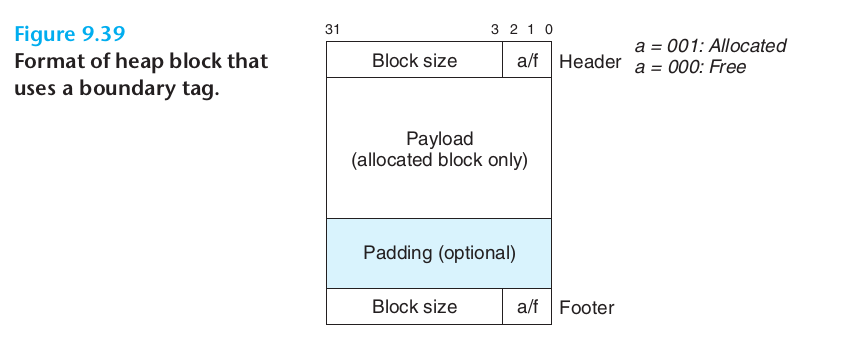
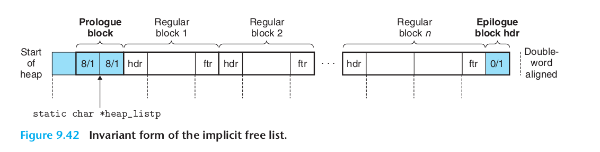
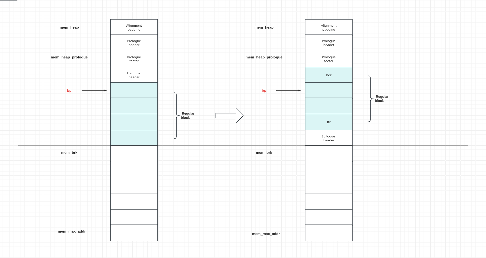

### Requirements

#### memory alignment

[Purpose of memory alignment](https://stackoverflow.com/questions/381244/purpose-of-memory-alignment)

-  A memory address is said to be aligned when the data referenced by said address is b bits long, and said address is b-bits aligned.(首先，内存对齐是针对变量的地址而言)
- The CPU always reads at its word size (4 bytes on a 32-bit processor, aka cache line), so when you do an unaligned address access — on a processor that supports it — the processor is going to read multiple words.(这里说出了根本原因，增加了访存速度。因为cpu每次读取的单位都是word size，如果地址不按32-bits aligned，那么对于某一个变量的读取，需要多次读取操作)
- 4 bytes alignment means they are positioned in 4 bytes

#### Intro

- 首先说了什么是heap
- 其次，allocator管理heap
- 再者，说了allocator分两类
- 最后，说了怎么用standart allocator + application-specific allocator

- Adynamic memory allocator maintains an area of a process’s virtual memory
known as the heap (Figure 9.33).
- We will assume that the heap is an area of demand-zero memory
that begins immediately after the uninitialized data area and grows upward
(toward higher addresses).
- An allocator maintains the heap as a collection of various-size blocks.
- Each block is a contiguous chunk of virtual memory that is either allocated or free. 
    - chunk是内存(heap)组织的最小单元
    - block是内存(heap)分配的最小单元，每次至少分配一个block，后者由连续的chunk组成

- We often use the standard allocator to acquire a large block of virtual memory
and 
- then use an application-specific allocator to manage the memory within that
block as the nodes of the graph are created and destroyed.


#### 9.9.1 The malloc and free Functions

内存按字节组织

00000000 byte 0 (0x00000000)
00000000 byte 1 (0x00000001)
...
00000000 byte 15 (0x000000015)

左边是按纯二进制来组织内存数据，右边是地址。cpu32位，那么地址一定32位。
发现一个规律，带十六进制表示的，都是内存地址。
因为寄存器就那么大
#### 9.9.2 Why Dynamic Memory Allocation?

The most important reason that programs use dynamic memory allocation is that
often they do not know the sizes of certain data structures until the program
actually runs.

#### 9.9.3 Allocator Requirements and Goals

- Ruirements
    - Handling arbitrary request sequences.(malloc/free的顺序不能保证，就是随机的来，不能假设其中的顺序，这隐式的显示了我们的分配策略。比如，如果刚来都是malloc，那么我可以一次分配多点。下次来啦，就移动指针即可，但实际不行)
    - Making immediate responses to requests.(限制了分配策略，no buffer, no reorder)
    - Using only the heap.(这话我觉得是废话，但我也没看懂他的解释)
    - Aligning blocks(对齐这个不用说了，为了cpu)
    - Not modifying allocated blocks.(no packation)

- Goals
    - 1.快。处理请求快
    - 2.高。内存使用率高

#### 9.9.4 Fragmentation

- 碎片
    - 内部。padding导致。
    - 外部。总和大小够，但是也不能分配。
    - 少量大块，好于大量小块。大量小块容易造成external fragment.

这里我补充一下，对于allocator，主要平衡的点在于
- speed
- utilization
即分配内存的速度和内存使用率。二者是反比关系，所以需要trade-off.

#### 9.9.5 Implementation Issues

这一小节先说了非常理性的情形，那我们就顺序管理，来一个请求，移动heap pointer即可。但是问题很明显，不能复用。并且如果请求多，很快就用完了。

A practical allocator that strikes a better balance between throughput and utilization must consider the following issues:

- Free block organization. How do we keep track of free blocks?(这个我理解非常重要，因为每次分配，其实就是从free block进行分配，所以free block的管理尤为重要)
- Placement. How do we choose an appropriate free block in which to place a
newly allocated block?(这个和上面的配合，讨论的都是如何分配的问题，怎么样选一个块出来，会直接影响utilization)
- Splitting. After we place a newly allocated block in some free block, what do
we do with the remainder of the free block?(紧接着上面的问题，怎么处理伤口，晾着？缝合？具体到技术，头尾相连，还是分开，或者compaction再调整？)
- Coalescing. What do we do with a block that has just been freed?(对于被释放的块，怎么合入？)

其实allocated block，归app管。allocator主要就是考虑free block

#### 9.9.6 Implicit Free Lists

Implicit Free Lists这个方法更多的是从Free block organization角度来说的。为什么说更多，因为这种方法肯定也涉及placement/splitting/coalescing。但是其他的方法也涉及，这个方法和其他方法根本的差异还是block organization.

- for each block we need both size and allocation status(这个很自然，heap通过block组织起来，block通过chunk组织，自然也需要类似的header信息)
    - chunk(分配的最小单位)，按8字节对齐。
    - block肯定是若干个chunk，所以size一定是对齐位数的倍数。
    - 比如block size may be 8(1000)/16(10000)/24(11000)
    - low 3 bits are zero -> 我们可以用低3位存储别的信息
        - 同时，在计算size时需要用mask

关于为什么叫implicit free lists，原因在于相比explicit free lists，这些free block并不是通过pointer显示的连接在一起。allocated和free block按照初始顺序连接在一起，通过标记位来判断是不是free block。(Most allocators embed this information in the blocks themselves)

- The advantage of an implicit free list is simplicity.
- A significant disadvantage is that the cost of any operation that requires a search of the free list, such as placing allocated blocks, will be linear in the total number of allocated and free blocks in the heap.

所以，由于是隐式的连接free block。所以，拿到free block需要线性时间。

最后，block是通过implicit lists连接，每一个block的结构header + payload + padding(optional)，并且memory alignment要求minimus block size。比如，8字节对齐，最小的block就是8字节.这意味着
- auto p = malloc(1)。
- 但是实际分配了一个最小块，8字节。
    - one word for header, one word for data(payload + padding).
    - 其中前4个字节for header，(3 for block size and 1 for flag)
    - 后4个字节for payload，1 for user and 3 for padding. 
    
说一下9.36
- 每个正方形表示4个字节，表示一个字(32bit) or a cache-line(one word).
- 一个chunk是8个字节，表示2个字。由于是按照double-word对齐，所以其作为最小的分配单位，表示一个chunk
- block自然是多个chunk构成，具体的大小，在header中给出。

结合9.35来说
- 这里的画法和9.36不一样，这里一个字用一行表示。
- 由于一个chunk是double-word对齐
    - 所以对于任意一个block而言，第一个chunk的第一个字，用来充当header
    - 所以，任意一个block，大小一定是8字节的整数倍，8/24/32，(1000/11000/1111000)
    - 剩下3位可以用来编码其他信息，高29位用来编码block size(nice touch)
    - 注意，block size是整个chunk的大小，自然包含header+payload+padding

#### 9.9.7 Placing Allocated Blocks(finding a free block)

- First fit: 最简单的想法，最快。类似于greedy策略
- Next fix: 在上一次搜索的结尾，接着搜索(if we found a fit in some free block the last time, there
is a good chance that we will find a fit the next time in the remainder of the block)
- Best fix: 恰恰好的问题是，时间开销大。优点自然是利用率高。

#### 9.9.8 Splitting Free Blocks(allocating in a free block:splitting)

这块我理解错了，之前理解成，分配出去之后，剩余块怎么组织。其实不是，比如我们现在找到了一个block(不管用什么策略，假如first fit)
此时有个问题，就是分配剩下的块大小，如果小于对齐块大小。此时，不能做split，否则后者无法对齐。应该整体一起分配出去。
如果剩余块满足对齐大小，则需要做split.将一个整块分割成已分配块和剩余块。

这里主要是针对header做出初始化的调整。
#### 9.9.9 Getting Additional Heap Memory

- One option is to try to create some larger free blocks by merging (coalescing) free
blocks that are physically adjacent in memory (next section).
- if the free blocks are already maximally
coalesced, then the allocator asks the kernel for additional heap memory by calling
the sbrk function.

两种方式，如果是一些外部碎片，想办法通过merging解决。如果空间已经不够了。那只能向kernel(system allocator)申请，获取更多的内存给application allocator.

#### 9.9.10 Coalescing Free Blocks

空闲块merge，不merge可能导致false fragmentation，比如
- 前一个块4字节
- 后一个块也4字节，刚才分配，目前释放。如果不merge，两个块看到的都是4个字节。
- 加入现在一个请求来，要分配6个字节，子找不到这样的快。所以，需要merge

那么，关于merge的时机是个问题。
- 第一种，每次free后，进行merge
- 第二种，如果请求的块，大小不够时，才进行merge
- csapp的说法是，目前性能较好的allocator，都是采用后者。

#### 9.9.11 Coalescing with Boundary Tags

But how would we coalesce the previous block? 

笨办法是，每次free的时候，从头开始遍历到当前节点，记住那些free的块，然后merge。显然free操作的时间复杂度是O(N)

- Adding a footer (the boundary tag) at the end of each block, where the footer is a replica of the header.
- If each block includes such a footer, then the allocator can determine the starting location and status of the previous
block by inspecting its footer, which is always one word away from the start of the current block.

#### 9.9.12 Putting It Together: Implementing a Simple Allocator

说下9.42这个图，这个是最终的结构

It's an application-level allocator, not a system-level allocator.

##### Data Structure

- core data structure1: block



这个数据结构，footer is a replica of header. 这个其实很重要。
- header/footer的大小都是固定的。
- 当前block，可以拿到当前的size。自然可以拿到下一个块的size.
- 问题是怎么拿到上一个块的size呢？这个footer就起作用了。
    - 这个footer的设计，背后还体现着一个特别的设计思路：就是冗余。
    - 以极小的代价，换来了，操作的便利性。这样给出一个块的header或者payload
        - 可以向前找
        - 也可以向后找
        - 这里header/footer是不是和explist free list当中的双向指针对应。
        - 设计上是完全对应的，It's beatutiful.
- block遵循 2-word alignment
    - 1 word = 4bytes, 2 words = 8bytes, 2 words alignment means the size of block is multiple of 8 bytes.
    - The remaining 3 bits are always zero which can ecode other information.

- core data structure2: free list



- word: 代表图中的一个小块，4bytes
- double-word: 代表图中的两个小块，8 bytes, 2 blocks，对齐的单位，最小的分配单位. 2-words alignment
    - 好处在于，大小都是8bytes的整数倍，低3位都是0
    - 低三位可以用来存储allocated tag.
- first padding block: The first word is an unused padding word aligned to a double-word boundary.
- prologue block
    - which is an 8-byte allocated block consisting of only a header and a footer.
    - which is created during initialization and is never freed.
- regular blocks that are created by calls to malloc or free.
- epilogue block,which is a zero-size allocated block that consists of only a header.
- The prologue and epilogue blocks are tricks that eliminate the edge conditions during coalescing.
- 由于prologue和epilogue大小不一样，8bytes/4bytes，所以搞了一个first padding block，凑齐aligned to a double-word boundary.
- The minimum block size is 16 bytes.
    - header/footer are is 8 bytes.
    - the minimum payload+padding is 8 bytes.

##### General Allocator Design

- Our allocator uses a model of the memory system provided by the memlib.c
    - The purpose of the model is to allow us to run our allocator without interfering with the existing system-level malloc package.
    - Deatails:
        - The ```MemInit``` function models the virtual memory available to the heap as a large double-word aligned array of bytes.
        - The bytes between ```mem_heap_``` and ```mem_brk_``` represent allocated virtual memory.
        - The bytes following ```mem_brk_``` represent unallocated virtual memory.
        - The allocator requests additional heap memory by calling the ```MemSbrk``` function
- Our allocator exports 3 functions(API) to application programs
    - The ```Init``` function initializes the allocator, returing 0 if successful and -1 otherwise.
    - The ```Malloc``` and ```Free``` functions have the same interfaces and semantics as their system counterparts.
- Our allocator uses the block format as above.
    - The minimus block size is double-word.
    - The free list is organized as an implicit free list.

##### Implementation Details

- Block detais
    - The first word is an unused padding word aligned to a double-word boundary
    - The padding is followed by a special prologue block, 
        - which is an 8-byte allocatedblock consisting of only a header and a footer. 
        - The prologue block is created during initialization and is never freed.
    - Following the prologue block are zero or more regular blocks that are created by calls to malloc or free
    - The heap always ends with a special epilogue block,
        - which is a zero-size allocated block that consists of only a header.
    - The prologue and epilogue blocks are tricks that eliminate the edge conditions during coalescing.

关于这个trick，我说一下。确实有点意思。
- regular block没什么说的。
- prologue block(header + footer)，这里加个footer，我理解是为了对齐，真正起作用的还是header.
- epilogue block(footer)，这里就是一个word.replica of header.
- 最后说这个header padding
    - 作用在于,coalescing的时候，merge也需要对齐。
    - 此时，padding + epilogue block变成一个regular block。这个是最精妙的地方。

- brk()  and  sbrk()  change the location of the program break, 
    - which defines the end of the process's data segment (i.e., the program break is the first location after the end of the uninitialized datasegment).  
    - Increasing the program break has the effect of allocating memory to the process; 
    - decreasing the break deallocates memory.
- brk() sets the end of the data segment to the value specified by addr
- sbrk() increments the program's data space by increment bytes.

```c
// brk, sbrk - change data segment size
SYNOPSIS
       #include <unistd.h>

       int brk(void *addr);

       void *sbrk(intptr_t increment);
```

关于宏的实现，说一下怎么根据当前bp找上一个bp
- 本质是先拿到上一个块的size，这个怎么拿，取上一个footer. 所以是```(char *)(bp) - DSIZE)```
- 上面的操作，拿到上一个footer，然后根据footer，计算出上一个块的大小。
- 最后，当前payload地址减去上一个块的大小，就是上一个块的payload地址。
```c++
/* Given block ptr bp, compute address of next and previous blocks */
#define NEXT_BLKP(bp) ((char *)(bp) + GET_SIZE(((char *)(bp) - WSIZE)))
#define PREV_BLKP(bp) ((char *)(bp) - GET_SIZE(((char *)(bp) - DSIZE)))
```

- ```MemSbrk```这个函数我再说一下，我一直感觉语意不是搞得很明白。
    - 1st, 这个函数移动brk指针。brk是size的范围。max_heap是capacity范围
    - 2nd，这个函数返回的是本次申请内存的首地址。之前总是强调previous sbrk，其实很容易忽略这点。
```cpp
void* NaiveAllocator::MemSbrk(int incr) {
  // sbrk() returns the previous program break.
  auto* old_brk = mem_brk_;
  if (incr < 0 or mem_brk_ + incr > mem_max_addr_) {
    std::cerr << "Sbrk failed. Run out of memory.\n";
    return nullptr;
  }
  mem_brk_ += incr;
  return old_brk;
}
```

- ```ExtendHeap```这个函数有点东西(somewhat subtle)，它做了如下的变化。
    - 分配出来的内存地址，其实不是payload地址。
    - 但是，合并了上一个epilogue block
        - epilgue block只有header没有footer
        - 所以刚好是一个word.
    - 同时，自己分配出来的最后一个word，充当epilogue block。
    - 从而让分配出来的内存首地址，变成了payload.
    - 从而，可以进行任何基于payload地址计算的操作。
    - That's god damn awesome!!!



##### Summary

- 虽然我用cpp写了代码，但整体风格还是c-style.
  - 因为并没有用到oo的东西, 抽象，封装，继承都没有。
  - 只是用了一些cpp的语法，诸如named cast来避免c-style cast
- c-style的代码可读性还是很差。
  - 没有显示数据结构的封装。
  - 通过地址重解析(reinterpret_cast)来表明对应的数据结构，非常难于理解。
  - 大量的地址操作，宏使用。
- 核心还是对于逻辑结构的操作。
  - Header/Footer
  - 以及prev_block/next block对应header/footer的修改。
  - 物理内存就是在那里，用或不用，都在那里。操作的本质是逻辑结构，由逻辑结构来表明是否在用。
- Malloc的核心操作
  - Search(如何高效实现)
  - Place
- Free的核心操作
  - coalescing(boundry tag，核心中的核心)
  - 使得常量时间复杂度完成了merge操作。
