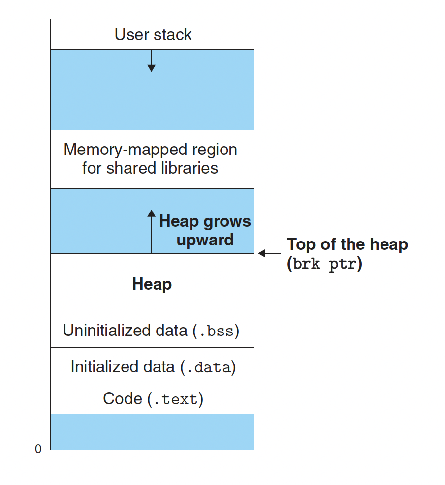

### Requirements

#### memory alignment

[Purpose of memory alignment](https://stackoverflow.com/questions/381244/purpose-of-memory-alignment)

-  A memory address is said to be aligned when the data referenced by said address is b bits long, and said address is b-bits aligned.(首先，内存对齐是针对变量的地址而言)
- The CPU always reads at its word size (4 bytes on a 32-bit processor, aka cache line), so when you do an unaligned address access — on a processor that supports it — the processor is going to read multiple words.(这里说出了根本原因，增加了访存速度。因为cpu每次读取的单位都是word size，如果地址不按32-bits aligned，那么对于某一个变量的读取，需要多次读取操作)
- 4 bytes alignment means they are positioned in 4 bytes

#### Intro

- 首先说了什么是heap
- 其次，allocator管理heap
- 再者，说了allocator分两类
- 最后，说了怎么用standart allocator + application-specific allocator

- Adynamic memory allocator maintains an area of a process’s virtual memory
known as the heap (Figure 9.33).
- We will assume that the heap is an area of demand-zero memory
that begins immediately after the uninitialized data area and grows upward
(toward higher addresses).
- An allocator maintains the heap as a collection of various-size blocks.
- Each block is a contiguous chunk of virtual memory that is either allocated or free. 
    - chunk是内存(heap)组织的最小单元
    - block是内存(heap)分配的最小单元，每次至少分配一个block，后者由连续的chunk组成

- We often use the standard allocator to acquire a large block of virtual memory
and 
- then use an application-specific allocator to manage the memory within that
block as the nodes of the graph are created and destroyed.



#### 9.9.1 The malloc and free Functions

内存按字节组织

00000000 byte 0 (0x00000000)
00000000 byte 1 (0x00000001)
...
00000000 byte 15 (0x000000015)

左边是按纯二进制来组织内存数据，右边是地址。cpu32位，那么地址一定32位。
发现一个规律，带十六进制表示的，都是内存地址。
因为寄存器就那么大
#### 9.9.2 Why Dynamic Memory Allocation?

The most important reason that programs use dynamic memory allocation is that
often they do not know the sizes of certain data structures until the program
actually runs.

#### 9.9.3 Allocator Requirements and Goals

- Ruirements
    - Handling arbitrary request sequences.(malloc/free的顺序不能保证，就是随机的来，不能假设其中的顺序，这隐式的显示了我们的分配策略。比如，如果刚来都是malloc，那么我可以一次分配多点。下次来啦，就移动指针即可，但实际不行)
    - Making immediate responses to requests.(限制了分配策略，no buffer, no reorder)
    - Using only the heap.(这话我觉得是废话，但我也没看懂他的解释)
    - Aligning blocks(对齐这个不用说了，为了cpu)
    - Not modifying allocated blocks.(no packation)

- Goals
    - 1.快。处理请求快
    - 2.高。内存使用率高

#### 9.9.4 Fragmentation

- 碎片
    - 内部。padding导致。
    - 外部。总和大小够，但是也不能分配。
    - 少量大块，好于大量小块(没懂)

#### 9.9.5 Implementation Issues

这一小节先说了非常理性的情形，那我们就顺序管理，来一个请求，移动heap pointer即可。但是问题很明显，不能复用。并且如果请求多，很快就用完了。

A practical allocator that strikes a better balance between throughput and utilization must consider the following issues:

- Free block organization. How do we keep track of free blocks?(这个我理解非常重要，因为每次分配，其实就是从free block进行分配，所以free block的管理尤为重要)
- Placement. How do we choose an appropriate free block in which to place a
newly allocated block?(这个和上面的配合，讨论的都是如何分配的问题，怎么样选一个块出来，会直接影响utilization)
- Splitting. After we place a newly allocated block in some free block, what do
we do with the remainder of the free block?(紧接着上面的问题，怎么处理伤口，晾着？缝合？具体到技术，头尾相连，还是分开，或者compaction再调整？)
- Coalescing. What do we do with a block that has just been freed?(对于被释放的块，怎么合入？)

其实allocated block，归app管。allocator主要就是考虑free block

#### 9.9.6 Implicit Free Lists

Implicit Free Lists这个方法更多的是从Free block organization角度来说的。为什么说更多，因为这种方法肯定也涉及placement/splitting/coalescing。但是其他的方法也涉及，这个方法和其他方法根本的差异还是block organization.

- for each block we need both size and allocation status(这个很自然，heap通过block组织起来，block通过chunk组织，自然也需要类似的header信息)
    - chunk(分配的最小单位)，按8字节对齐。
    - block肯定是若干个chunk，所以size一定是对齐位数的倍数。
    - 比如block size may be 8(1000)/16(10000)/24(11000)
    - low 3 bits are zero -> 我们可以用低3位存储别的信息
        - 同时，在计算size时需要用mask

关于为什么叫implicit free lists，原因在于相比explicit free lists，这些free block并不是通过pointer显示的连接在一起。allocated和free block按照初始顺序连接在一起，通过标记位来判断是不是free block。

- The advantage of an implicit free list is simplicity.
- A significant disadvantage is that the cost of any operation that requires a search of the free list, such as placing allocated blocks, will be linear in the total number of allocated and free blocks in the heap.

所以，由于是隐式的连接free block。所以，拿到free block需要线性时间。

最后，block是通过implicit lists连接，每一个block的结构header + payload + padding(optional)，并且memory alignment要求minimus block size。比如，8字节对齐，最小的block就是8字节.这意味着
- auto p = malloc(1)。
- 但是实际分配了一个最小块，8字节。
    - 其中前4个字节for header，(3 for block size and 1 for flag)
    - 后4个字节for payload，1 for user and 3 for padding
    
说一下9.36
- 每个正方形表示4个字节，表示一个字(32bit) or a cache-line.
- 一个chunk是8个字节，表示2个字。由于是按照double-word对齐，所以其作为最小的分配单位，表示一个chunk
- block自然是多个chunk构成，具体的大小，在header中给出。

结合9.35来说
- 这里的画法和9.36不一样，这里一个字用一行表示。
- 由于一个chunk是double-word对齐
    - 所以对于任意一个block而言，第一个chunk的第一个字，用来充当header
    - 所以，任意一个block，大小一定是8字节的整数倍，8/24/32，(1000/11000/1111000)
    - 剩下3位可以用来编码其他信息，高29位用来编码block size(nice touch)
    - 注意，block size是整个chunk的大小，自然包含header+payload+padding

#### 9.9.7 Placing Allocated Blocks(finding a free block)

- First fit: 最简单的想法，最快。类似于greedy策略
- Next fix: 在上一次搜索的结尾，接着搜索(if we found a fit in some free block the last time, there
is a good chance that we will find a fit the next time in the remainder of the block)
- Best fix: 恰恰好的问题是，时间开销大。优点自然是利用率高。

#### 9.9.8 Splitting Free Blocks(allocating in a free block:splitting)

这块我理解错了，之前理解成，分配出去之后，剩余块怎么组织。其实不是，比如我们现在找到了一个block(不管用什么策略，假如first fit)
此时有个问题，就是需要的字节可能比这个块小很多。怎么处理？可以全分配出去，造成internal fragment。也可以把这个block分解了，再分配出去给user，提升使用率。

这里主要是针对header做出初始化的调整。
#### 9.9.9 Getting Additional Heap Memory

- One option is to try to create some larger free blocks by merging (coalescing) free
blocks that are physically adjacent in memory (next section).
- if the free blocks are already maximally
coalesced, then the allocator asks the kernel for additional heap memory by calling
the sbrk function.

两种方式，如果是一些外部碎片，想办法通过merging解决。如果空间已经不够了。那只能向kernel(system allocator)申请，获取更多的内存给application allocator.

#### 9.9.10 Coalescing Free Blocks

空闲块merge，不merge可能导致false fragmentation，比如
- 前一个块4字节
- 后一个块也4字节，刚才分配，目前释放。如果不merge，两个快看到的都是4个字节。
- 加入现在一个请求来，要分配6个字节，子找不到这样的快。所以，需要merge

那么，关于merge的时机是个问题。
- 第一种，每次free后，进行merge
- 第二种，如果请求的块，大小不够时，才进行merge
- csapp的说法是，目前性能较好的allocator，都是采用后者。

#### 9.9.11 Coalescing with Boundary Tags

But how would we coalesce the previous block? 

笨办法是，每次free的时候，从头开始遍历到当前节点，记住那些free的块，然后merge。显然free操作的时间复杂度是O(N)

- is to add a footer (the boundary tag) at the end of each block, where the footer is a replica of the header.
- If each block includes such a footer, then the allocator can determine the starting location and status of the previous
block by inspecting its footer, which is always one word away from the start of the current block.

#### 9.9.12 Putting It Together: Implementing a Simple Allocator

说下9.42这个图，这个是最终的结构

- word: 代表图中的一个小块，4bytes.
- double-workd: 代表图中的两个小块，8bytes, 1 chunk，对齐的单位，最小的分配单位
- first padding block: The first word is an unused padding word aligned to a double-word boundary.
- prologue block
    - which is an 8-byte allocated block consisting of only a header and a footer.
    - which is created during initialization and is never
- regular blocks
- epilogue block,which is a zero-size allocated block that consists of only a header.

- The prologue and epilogue blocks are tricks that eliminate the edge conditions during coalescing.
- 由于prologue和epilogue大小不一样，8bytes/4bytes，所以搞了一个first padding block，凑齐aligned to a double-word boundary.

```cpp
15 /* Read the size and allocated fields from address p */
16 #define GET_SIZE(p) (GET(p) & ~0x7)
17 #define GET_ALLOC(p) (GET(p) & 0x1)
```

这两个宏我说一下，32位，高29位为size，低3位自用，其中最低位表示是否分配。
- 所以，GET_ALLOC好理解，拿最低位
- GET_SIZE需要拿高29位，低3位是0x7(0000 0000 0000 0000 0000 0000 0000 0111)，这个数取反就是高29位
