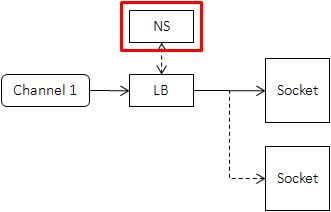

## Client

Let's take brpc as an example.

### Channel

- Client-side of RPC sends requests. It's called Channel rather than "Client" in brpc. 
- A channel represents a **communication line** to one server or multiple servers, which can be used for calling services.

While in trpc, cliend-side of RPC is called proxy.(The proxy could interface to anything: a network connection, a large object in memory. So proxy also make sense.)

- A Channel can be shared by all threads in the process.(Same as trpc proxy, it's very important.) 
- However creation and destroying of Channel is not thread-safe, make sure the channel is initialized and destroyed only by one thread.

Obviously, a channel also needs an option.

- Some RPC implementations have so-called "ClientManager", including configurations and resource management at the client-side, which is not needed by brpc.
- "thread-num", "connection-type" such parameters are either in brpc::ChannelOptions or global gflags. Advantages of doing so:
  - Convenience. You don't have to pass a "ClientManager" when the Channel is created, and you don't have to store the "ClientManager". Otherwise code has to pass "ClientManager" layer by layer, which is troublesome. gflags makes configurations of global behaviors easier.
  - Share resources. For example, servers and channels in brpc share background workers (of bthread).
  - Better management of Lifetime. Destructing a "ClientManager" is very error-prone, which is managed by brpc right now.

Oops, trpc is just the oposite of brpc when using options. It has a similar struct called options and client config should be filled in this struct.

A short summary,
- channel/proxy means a client-side of rpc.
- A channel can be shared by all threads in the process for both trpc and brpc.
- A channel should have an option.

### Connect to a server

A server has a fixed address. The creation does not need Naming service or Load balancer, being relatively light-weight.
The address could be a host name:
- 127.0.0.1:80
- www.foo.com:8765
- localhost:9000

Be careful, the address above are not naming service, they are just hostname, which means **a single ip-port**.

### Connect to a cluster

Channels get server list list from NamingService periodically or driven-by-events, and send request to one server chosen from the list according to the Load Balancing algorithm.

So, in order to connect a cluster, a channel should specify
- A namming service.(brpc.search_engine.ranking_server)
- A load balancer.

In trpc, naming service and load balancer are put into a single module called selector.

### Connection Type

Let's take brpc as an example.

brpc supports following connection types:
- short connection: Established before each RPC, closed after completion. Since each RPC has to pay the overhead of establishing connection, this type is used for occasionally launched RPC, not frequently launched ones. No protocol use this type by default. Connections in http/1.0 are handled similarly as short connections.
- pooled connection: Pick an unused connection from a pool before each RPC, return after completion. One connection carries at most one request at the same time. One client may have multiple connections to one server. http/1.1 and the protocols using nshead use this type by default.
- single connection: all clients in one process has at most one connection to one server, one connection may carry multiple requests at the same time. The sequence of received responses does not need to be same as sending requests. This type is used by baidu_std, hulu_pbrpc, sofa_pbrpc by default.

I think the most obvious drawback of short connection is the cost of eastablishment of each rpc, so it not suitable for frequently launched ones.