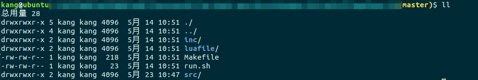

## 常用命令

### 文件

#### 2>&1
- 基本用法
```shell
nohup commond > /dev/null 2>&1 &

nohup       :后台执行，终端关闭会继续执行
/dev/null   :代表空设备文件
>           :代表重定向到哪里，例如：echo "123" > /home/123.txt
1           :表示stdout标准输出，系统默认值是1，所以">/dev/null"等同于"1>/dev/null"
2           :表示stderr标准错误
&           :表示等同于的意思，2>&1，表示2的输出重定向等同于1
&           :直接返回shell界面，如果终端退出，程序不会后台执行
```

参考
[Linux Shell 1>/dev/null 2>&1 含义](https://blog.csdn.net/ithomer/article/details/9288353)
[nohup ./start.sh> myout.file 2>&1 &](https://simon-9527.iteye.com/blog/2302675)

#### ln
- 基本用法
```shell
ln -sf tmp tmp-target

ln:         make links between files
ln [OPTION]... [-T] TARGET LINK_NAME   (1st form)
ln [OPTION]... TARGET                  (2nd form)
ln [OPTION]... TARGET... DIRECTORY     (3rd form)
ln [OPTION]... -t DIRECTORY TARGET...  (4th form)
```

- 软连接与硬链接的区别
    - 硬链接可认为是一个文件拥有两个文件名;而软链接则是系统新建一个链接文件
    - 软链接可对文件和文件夹，而硬链接仅针对文件

参考
[软链接与硬链接的区别](https://blog.csdn.net/netwalk/article/details/38039155)

#### ls
- 基本用法
```shell
ls [OPTION] [FILE]

-l       :long listing format
-h       :human-readable
-r       :reverse order when while listing
-t       :sort by modification time, newest first
```
- 格式说明


```shell
文件类型
所有者权限
组用户权限
其他用户权限
链接数
用户名
组名
文件大小
最后修改时间
文件名
```
参考
[Linux 下 ls -l 命令执行显示结果的每一列含义](https://blog.csdn.net/zhuoya_/article/details/77418413)
[What do the fields in ls -al output mean?](https://unix.stackexchange.com/questions/103114/what-do-the-fields-in-ls-al-output-mean)

---

### 进程/网络

#### 端口占用
- 基本用法
```shell
lsof -i:port 直接判断某个端口是否被占用
ps: 该命令只能查询当前用户启动的进程是否占用该端口, 如果查询整个系统，加上sudo选项
```

参考
[使用netstat lsof查看端口占用情况](http://lazybios.com/2015/03/netstat-notes/)

#### 判断进程占用端口

- linux
```shell
#获得进程号
ps -ef|grep [process name] 
#查看pid对应进程占用的端口
netstat -nlpt|grep pid
```

- macos
```shell
#获得进程号
ps -ef|grep [process name] 
#查看pid对应进程占用的端口
lsof -p pid | grep LISTEN
```
ps: macos netstat 功能和linux不完全一样

参考
[mac oxs 上查看进程监听的端口号 lsof](http://lazybios.com/2015/03/netstat-notes/)


## 环境配置

#### sz/rz

ps: rz/sz不是下载就能用，需要配置
参考<br>
[mac下rz/sz配置](https://segmentfault.com/a/1190000012166969)<br>