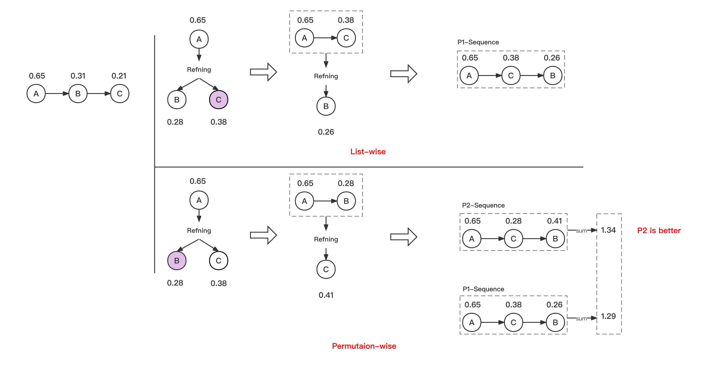
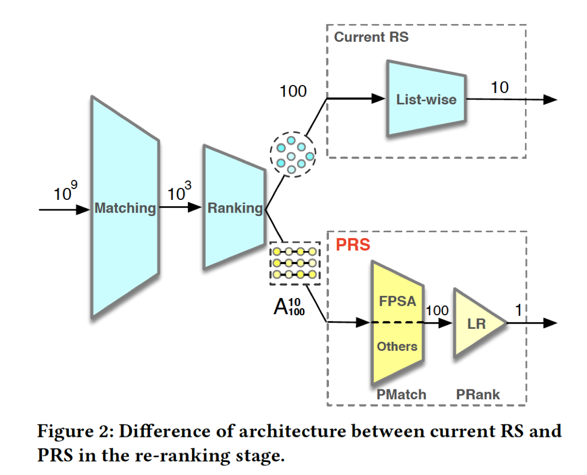

## ABSTRACT

作者从重排的视角，首先说了当前推荐系统的问题：进行文章匹配的时候，采用了贪心策略，在多序列的视角下，会存在如下两个问题。

1. They neglect addressing the **permutation variant influence** within the recommended results;
2. Permutation consideration extends the latent solution space **exponentially**, and
current RS lack the ability to evaluate the permutations.

为了解决这个问题，作者提出了一个名叫PRS的框架，主要包括以下两个阶段：
- Permutation-Matching (PMatch): 这个用来进行序列生成。
    - 基于beam-search，考虑了多序列变量
    - 高效，显著的降低了时间复杂度，让多序列生成变成可行。
- Permutation-Ranking (PRank):这个用来进行序列评估
    - 提出一种统一对序列进行建模的办法。(a unified permutation-wise ranking criterion named LR metric)
    - 评估完成后，选择lr metric分数最高的序列，作为最终的推荐结果。

最后说了下他们的效果。

## 1.INTRODUCTION

作者在这一部分还是整体介绍了重排的常见做法， 包括point-wise,list-wise等方法，陈述了各自的利弊，下面展开说一下。

- point-wise: user-item pairs建模，纯贪心。
- list-wise: 主要包括以下三步
    - Ranking: the initial list is generated according to scores of the basic ranking model;
    - Refining: the list-wise feature distribution of the initial list is extracted by a well-designed module (e.g., LSTM [1] and self-attention [25, 26]) to refine the rating scores;
    - Re-ranking: candidate items are re-ranked by the refined list-wise rating scores **in the greedy manner**.
    - Overall, existing list-wise methods achieve improvements in recommendations mainly by modeling list-wise
feature distribution to focus on refining the item’s rating scores.
     
这块我觉得说的挺清楚的，point-wise ctr主要对用户和物品的喜好进行建模，lise-wise refining ctr在point-wise ctr基础上融合了上下文的信息进行建模，目前listwise的重心还是在对于listwise特征的建模上。但不管ctr如何建模，重排算法本身还是贪心的。鉴于此，当前重排的做法不可能找到多序列视角下的最优解，因为目前的做法根本就没有考虑到序列的因素。

紧接着作者展示了在淘宝中的一个真实case来协助说明这个情况，我画了一个新图在下面：

我们直接看permutation-wise的部分，在生成P2-Sequence的时候，第二步，选取了一个分数较小的文章，没有做贪心选择。然后Refining，此时C这篇文章拿到一个意向不到的高分，从而导致整个序列的分数大于前一个序列。如果只是listwise的方式，显然不会有出这个更优的序列。

作者从购物的角度给了一个合理的解释，即把贵的东西放到前面，可能会促成用户购买相对便宜的物品。

上面这一部分，作者先给出了一个permutation-wise的视角来理解推荐，说明其方法的合理性，紧接着作者说了其在落地上面临的两个问题：
- Exponential solutions. 序列生成是指数时间复杂度，没法落地。
- Permutation-wise evaluation. 现在对于ctr的建模都是依赖user-item interaction，没有对序列进行建模的方式。

然后作者提出了解决这一问题的方式，即prs框架：

其中，PMatch用来解决序列生成的问题，PRank用来解决序列生成的问题。

## 2.RELATED WORK