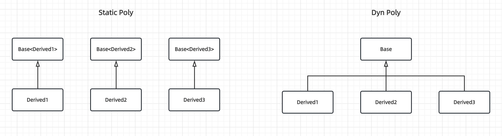

### 引子

最近的一项任务觉得可以用crtp来搞，准备研究一下这个东西。其实这玩意没少用，内部的rpc框架单例就是用crtp手法做的。会用没问题，但是对于其背后的设计思路，最佳实践，不甚了解，决定出手搞一下。

### 用法

下面直接上wiki的内容[Curiously recurring template pattern](https://en.wikipedia.org/wiki/Curiously_recurring_template_pattern)

#### General form

```cpp
// The Curiously Recurring Template Pattern (CRTP)
template <class T>
class X
{
    // methods within Base can use template to access members of Derived
};

class A : public X<A>
{
    // ...
};
```

从形式上来说，有一点反直觉，简单说，A存在，必须X<A>先存在。X<A>存在，必须A存在。鸡生蛋，蛋生鸡问题。我们看看wiki是怎么解释的。

>In the above example, the class ```X<A>```, though declared before the existence of the class ```A``` is known by the compiler (i.e., before class ```A``` is declared), is not actually instantiated by the compiler until it is actually called by some later code which occurs after the declaration of class ```A``` (not shown in the above example), so that at the time the class ```X<A>```is instantiated, the declaration of class ```A``` is known.

简单说，虽然定义上又先后，但class ```X```是一个模板，它不是一个类，所以上面说的依赖顺序问题，不存在。一旦实例化后，class ```A```和class ```X<A>``` 这两个类型编译器同时感知到，没问题。

下面说一下直观地认识，看下面代码：
```cpp
class MyString : public std::vector<MyString> {};
```

std::vector是一个模板，我这里定义一个MyString，继承自std::vector<MyString>。语义说不通，父类是一个vector string，派生类是一个string，语义上看起来都冲突了。这是一个很差的例子，没错，我就是要举一个这样的例子，和后面正确的例子对比看，我们才知道它到底怎么用。

再说另一个认识，代码注释也写了，基类拿到了派生类的类型，这样它可以访问成员。但是，这里千万要注意的是，```X<A>```具备获取A的能力，但是它肯定不是A。我们都知道public inheritance 表达的是一种is-a关系，可以认为```A``` is-a ```X<A>```，但反过来不行。所以，假如我们有一个```X<A>```的对象，它可以访问A的成员嘛？(注意，这里说的是在A中单独定义的成员)分两种情形
- 如果是static member，没问题。
- 但是，如果不是static member，也分两种情形
    - 如果是通过X<A>访问成员，有问题。因为X<A>不是A
    - 如果是通过A访问成员，自然没问题。
    - 这两点其实通过Static polymorphism下面讲解更好一点，这里不再赘述。

#### Static polymorphism

```cpp
template <class T> 
struct Base
{
    void interface()
    {
        // ...
        static_cast<T*>(this)->implementation();
        // ...
    }

    static void static_func()
    {
        // ...
        T::static_sub_func();
        // ...
    }
};

struct Derived : Base<Derived>
{
    void implementation();
    static void static_sub_func();
};
```

看起来很完美的一个例子，是吧。派生了给实现，父类给接口，和动态多态的思路一致。不过这个东西很容易用错。

我们可以先看一个错误的使用方式：
```cpp
void Test() {
  Base<Derived> this_is_a_base_object;
  this_is_a_base_object.interface()
}
```

这个使用有啥问题呢？问题就出在，this_is_a_base_object这个对象，它的类型是Base<Derived>，不是Derived。
那么interface内部，你把一个父类对象，强制转化为一个派生类对象，显然会导致undefined behavior.

正确的用法如下

```cpp
  Derived this_is_a_derived_object;
  this_is_a_derived_object.interface()
```

这么写自然没问题，但是还有问题，说好了叫静态多态，那你这个多态到底怎么体现？我们知道，动态多态，是通过基类的指针或者引用，指向继承体系的对象，然后调用虚函数体现的。那么，在静态多态里面，和基类指针或者引用，类似的这个角色在哪里？

我在[惯用法之CRTP](https://mp.weixin.qq.com/s/giSDMWLO0d7t3fX-ZC7eVg)看到下面这种用法

```cpp
#include <iostream>

template <typename T>
class Base{
 public:
  void interface(){
    static_cast<T*>(this)->imp();
  }
  void imp(){
    std::cout << "in Base::imp" << std::endl;
  }
};

class Derived1 : public Base<Derived1> {
 public:
  void imp(){
    std::cout << "in Derived1::imp" << std::endl;
  }
};

class Derived2 : public Base<Derived2> {
 public:
  void imp(){
    std::cout << "in Derived2::imp" << std::endl;
  }
};

class Derived3 : public Base<Derived3>{};

template <typename T>
void fun(T& base){
    base.interface();
}


int main(){
  Derived1 d1;
  Derived2 d2;
  Derived3 d3;

  fun(d1);
  fun(d2);
  fun(d3);

  return 0;
}
```

这个看起来好像没问题，```T& base```充当类类似动态多态中，基类指针的用法。但问题是，既然你这么写，那我下面这种写法不行吗？

```cpp
template <typename T>
void fun(T& base){
    base.impl();
}
```

所以上面的代码，看起来好像有点多此一举。那么用private限定符修饰impl可以吗？这样不就好了，只能通过```interface```调用。但这么做也不行，基类将this指针转化为派生类的指针后，只能调用public接口。因此，如果采用crtp来实现static poly，那么派生类的impl方法只能是public接口，看上去是多此一举，但是也没办法。

这里再说一点，也是我之前一直没理解到的地方，我们看一下它这个多态的调用，即```fun```的设计，为什么是个模板？

我们看下面的类图



其实对于crtp(static-poly)来说，这些派生类并不像dyn-poly那样，位于一个继承体系中，即彼此之间没有关系。对于dyn-poly，由于所有派生类在一个继承体系中，所以可以通过一个基类的指针，来实现多态。由于static-poly的派生类没有这种关系，不过他们的父类接口一样，因此可以通过模板来复用代码，模板实例化之后，还是不同的父类。这也是为什么```fun```的设计是个模板的原因。

最后，给一组对比代码，看看static-poly和dyn-poly的实现。

```cpp
#include <iostream>
#include <memory>
#include <string>
#include <vector>

namespace dyn_poly {

class Filter {
 public:
  virtual ~Filter() = default;

  virtual std::string Name() const = 0;
};

class CatFilter : public Filter {
 public:
  std::string Name() const override { return "CatFilter"; }
};

class TagFilter : public Filter {
 public:
  std::string Name() const override { return "TagFilter"; };
};

void Test() {
  std::vector<std::unique_ptr<Filter>> filters;
  filters.emplace_back(std::make_unique<CatFilter>());
  filters.emplace_back(std::make_unique<TagFilter>());

  for (const auto& filter : filters) {
    std::cout << filter->Name() << std::endl;
  }
}

}  // namespace dyn_poly

namespace static_poly {

template<typename T>
class Filter {
 public:
  std::string Name() {
    return static_cast<T*>(this)->GetName();
  }
};

class CatFilter : public Filter<CatFilter> {
 public:
   std::string GetName() const { return "CatFilter"; }
};

class TagFilter : public Filter<TagFilter> {
 public:
   std::string GetName() const { return "TagFilter"; }
};

template<typename T>
void PolyCall(T& filter) {
  std::cout << filter.Name() << std::endl;
}

void Test() {
  CatFilter cat_filter;
  TagFilter tag_filter;

  PolyCall(cat_filter);
  PolyCall(tag_filter);
}

}  // namespace static_poly

int main(void) {
  dyn_poly::Test();
  static_poly::Test();
  return 0;
}
```

最后，根据我自己的实践经验，如果插件较多，需要指针数组来组织的时候，只能是dyn-poly，如果是run time才构造对象，也只能是dyn-poly。否则，可以考虑static-poly，我最近写的diffchecker使用了static-poly,原因在于，不需要run time才构造对象，同时插件较少。

#### Object counter

The main purpose of an object counter is retrieving statistics of object creation and destruction for a given class.

```cpp
template <typename T>
struct counter
{
    static inline int objects_created = 0;
    static inline int objects_alive = 0;

    counter()
    {
        ++objects_created;
        ++objects_alive;
    }
    
    counter(const counter&)
    {
        ++objects_created;
        ++objects_alive;
    }
protected:
    ~counter() // objects should never be removed through pointers of this type
    {
        --objects_alive;
    }
};

class X : counter<X>
{
    // ...
};

class Y : counter<Y>
{
    // ...
};
```

这种用法的另一个常见实现是singleton，不再赘述。对于这个例子，也有一些点需要注意：

-  It is important to note that counter<X> and counter<Y> are two separate classes and this is why they will keep separate counts of Xs and Ys
- In this example of CRTP, this distinction of classes is the only use of the template parameter (T in counter<T>) and the reason why we cannot use a simple un-templated base class.

这里强调的和上一小节最后的部分一致，即强调了派生类的独立性，彼此之间没什么关系。最好的例子来自于对于单例的理解，每一个想成为单例的类，彼此之间没什么关系。倘若是dyn-poly，不可能是单例，不同派生类中的基类都会重叠。

#### Polymorphic copy construction

When using polymorphism, one sometimes needs to create copies of objects by the base class pointer. A commonly used idiom for this is adding a virtual clone function that is defined in every derived class. The CRTP can be used to avoid having to duplicate that function or other similar functions in every derived class.

这个点我说下，就是实现Clone接口，传统的办法是基类声明```virtual Clone```接口，然后派生类自己实现。缺点是每个派生类都需要定义，重复的工作。crtp可以解决，不过再看crtp的办法前，我先给出一般的解法。因为我去年碰到了这个问题，看了folly/oneflow的实现，大家没有借用crtp去做，而是用宏来解决，一样很便捷。

 ```cpp
 // common.h
 #define DECLARE_CLONE(BaseClass) \
  virtual std::shared_ptr<BaseClass> Clone() const = 0;

#define DECLARE_SET_DATA(BaseClass) \
  virtual void SetData(const std::shared_ptr<BaseClass>& other) = 0;

#define DECLARE_CLONE_AND_SET_DATA(BaseClass) \
  DECLARE_CLONE(BaseClass)                    \
  DECLARE_SET_DATA(BaseClass)

#define DEFINE_CLONE(BaseClass, SubClass)             \
  std::shared_ptr<BaseClass> Clone() const override { \
    return std::make_shared<SubClass>(*this);         \
  }

#define DEFINE_SET_DATA(BaseClass, SubClass)                           \
  void SetData(const std::shared_ptr<BaseClass>& other) override {     \
    const auto& mirrored = std::dynamic_pointer_cast<SubClass>(other); \
    *this = *mirrored;                                                 \
  }

#define DEFINE_CLONE_AND_SET_DATA(BaseClass, SubClass) \
  DEFINE_CLONE(BaseClass, SubClass)                    \
  DEFINE_SET_DATA(BaseClass, SubClass)

// rule_base.h
class RuleBase {
 public:
  virtual ~RuleBase() = default;

  DECLARE_CLONE_AND_SET_DATA(BasicRule);
};
#define DEFINE_RULE_CLONE_AND_SET_DATA(SubClass) \
  DEFINE_CLONE_AND_SET_DATA(RuleBase, SubClass) \

// cat_rule.h
class CatRule : public RuleBase {
 public:
  DEFINE_RULE_CLONE_AND_SET_DATA(CatRule);
};

// tag_rule.h
class TagRule : public RuleBase {
 public:
  DEFINE_RULE_CLONE_AND_SET_DATA(TagRule);
};
 ```

 宏的办法也非常简洁，不会有大量的冗余代码，目前我工作中使用的是这种办法。下面我们看crtp的解法

 ```cpp
 class RuleBase {
  public:
   virtual ~RuleBase() = default;
   virtual std::shared_ptr<RuleBase> clone() const = 0;
 };

template <typename DerivedRule>
class RuleHelper : public RuleBase {
 public:
  std::shared_ptr<RuleBase> clone() const override {
    return std::make_shared<DerivedRule>(static_cast<Derived const&>(*this));
  }
}

class CatRule : public RuleHelper<CatRule> {

};

class TagRule : public RuleHelper<TagRule> {

};
```

- 这个写法的形式，和之前的两种又不一样，这个是一个三层的结构。因为crtp的继承是相互独立的，派生类之间没有关系。但是，题目的要求又需要有，因此又加了一层。
- 我们看这个第二层，本质它是对派生类的类型做了抽象，否则无法通用化clone代码。wiki特别强调了必须是三层，两层是显然不行的。因为派生类的父类，没有关系。
- 总体来说，这种办法没有宏的办法简洁。

#### Polymorphic chaining

直接看wiki给出的代码

```cpp
class Printer
{
public:
    Printer(ostream& pstream) : m_stream(pstream) {}
 
    template <typename T>
    Printer& print(T&& t) { m_stream << t; return *this; }
 
    template <typename T>
    Printer& println(T&& t) { m_stream << t << endl; return *this; }
private:
    ostream& m_stream;
};
Printer(myStream).println("hello").println(500);

class CoutPrinter : public Printer
{
public:
    CoutPrinter() : Printer(cout) {}

    CoutPrinter& SetConsoleColor(Color c)
    {
        // ...
        return *this;
    }
};
CoutPrinter().print("Hello ").SetConsoleColor(Color.red).println("Printer!"); // compile error
```

问题出在，派生类想复用基类的代码，但是其返回值返回的是基类的对象，后者无法调用派生类的方式，从而无法channing.

#### 小结

我想有以下几个点是需要格外注意的：
- 对于static-poly这种用法
  - static-poly vs dyn-poly，我个人理解最重要的区别在于继承体系的差异。
  - 继承的使用上，复用了基类的interface接口，派生类需要实现impl方法。基类和派生类一起实现了某一种功能。
- 对于object counter这种用法
  - 引入模板的继承，和普通继承的区别，同static-poly用法的第一点，即是多个继承体系，不是一套。模板使能了多套这个能力，这是模板的作用。
  - 继承的使用上，派生类和基类更像是一种A is implementated in terms of B的关系，派生类也使用基类的接口，这是一部分功能。但派生类的接口会实现另一部分功能，他们是相对独立的，而不是一起实现了某种功能。
