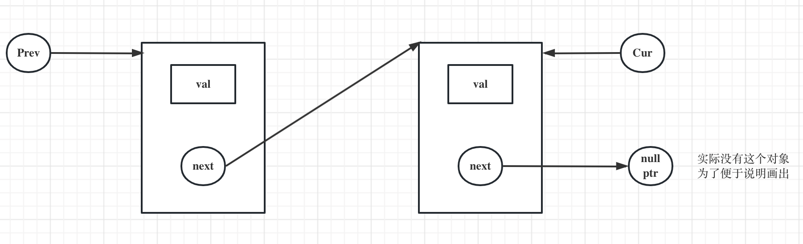
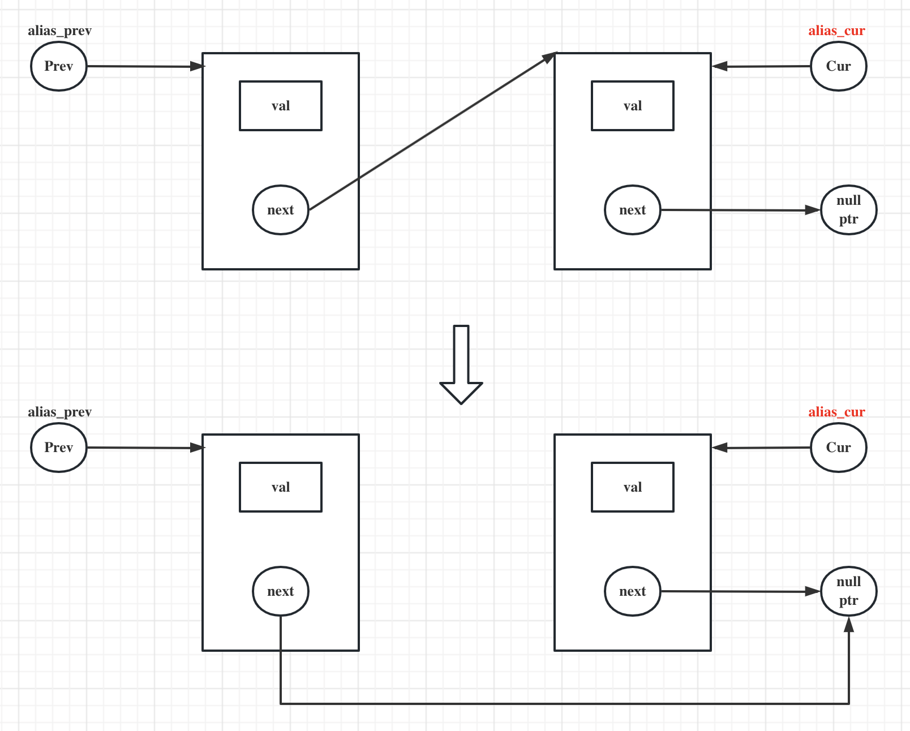
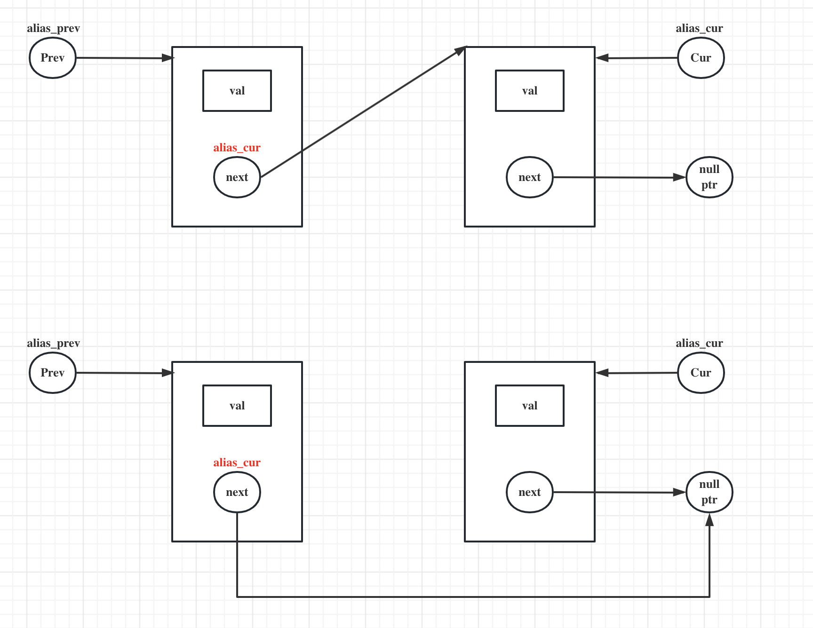

### 引子

这两天碰到一个头秃的问题，一段非常简单的代码coredump，但是排查的直觉和看到的现象一直不匹配。用下面这段简单的代码模拟。

```cpp
struct Node {
  char val = 0;
  Node* next = nullptr;

  Node() = default;
  explicit Node (int v) : val(v), next(nullptr) {}
  Node (int v, Node* n) : val(v), next(n) {}
};

void del_cur(Node*& prev, Node*& cur) {
  prev->next = cur->next;
  cur->val += 1; 
}

void test() {
  auto cur = new Node(2);
  auto prev = new Node(1, cur);
  del_cur(prev, prev->next);
  delete cur;
  delete prev;
}

int main() {
  test();
  return 0;
}
```

### 排查

迅速定位，发现导致代码coredump的问题是空指针访问

```cpp
void del_cur(Node*& prev, Node*& cur) {
  prev->next = cur->next;
  cur->val += 1;  // nullptr dereference
}
```

对于这个现象，和预期不相符的是：代码里没有改动cur，为什么cur会变成nullptr。

但事实是，确实变了，所以继续追查的线索就是，在哪变的？肉眼看不出来，借助汇编视角排查，其汇编代码如下(x86-64 gcc 9.4 with -O2)

```x86asm
del_cur(Node*&, Node*&):
        mov     rdx, QWORD PTR [rsi]
        mov     rax, QWORD PTR [rdi]
        mov     rdx, QWORD PTR [rdx+8]
        mov     QWORD PTR [rax+8], rdx
        ret
```

从汇编代码里，我们发现源代码```prev->next = cur->next```在汇编指令里，其实体现为如下两句话

- ```cur = cur->next```
- ```prev->next = cur```

好，排查至此，我们确定了cur确实变了，但是为啥会变成这样。目光投向参数，是不是pass-by-reference引入的问题。为了验证猜想，
我们看一下pass-by-value的情形

```cpp
del_cur(Node*, Node*):
        mov     rax, QWORD PTR [rsi+8]
        mov     QWORD PTR [rdi+8], rax
        ret
```

这一段汇编和我们的```prev->next = cur->next```在理解上对应的，没有问题。

到这里，代码中问题算是定位了，参数传递这里pass-by-reference有问题，但是，因为实际代码中，我有更新prev/cur的需求，所以这里也必须传引用。

因为prev->next本质和cur指向同一块内存，我做如下调整：

```cpp
//del_cur(prev, prev->next); 
del_cur(prev, cur);
```

结果，更有意思的是，代码正常，但是汇编代码没有变。总结下这个奇怪的现象
- 首先，第二个参数不管传递prev->next or cur，其汇编代码没有区别，这也表明上面得出的结论(cur更新和pass-by-reference有关)不正确。
- 其次，前者会导致coredump，但后者不会。
- 再次，prev->next 和 cur本质是同一块内存。
- 最后，有意思的是，既然是同一块内存，为啥你行我不行？

我们重新回到代码，再仔细分析(便于分析，更换了形参名称)：

```cpp
void del_cur(Node*& alias_prev, Node*& alias_cur) {
  alias_prev->next = alias_cur->next;
  alias_cur->val += 1;  
}
del_cur(prev, cur);  // right
del_cur(prev, prev->next)  // wrong
```

- 对于```del_cur```本身，既然有成功的case，也有失败的case，不必现。所以，虽然问题暴露在这里，但这不是根源。
- 对于函数调用，唯一的区别就是实参的区别，前者正确，后者错误。我们进一步展开看看
    - ```Node*& alias_cur = cur```
    - ````Node*& alias_cur = prev->next```
    - 还是没觉得有什么差异，prev->next == cur，这个关系是肯定成立的。

我在实际排查的时候，这里确实没看出区别。也没有别的办法，我就像画个图看看，形象化的表述，是不是带来一些理解上的启发。

- 初始化的结构如下



- ```Node*& alias_cur = cur``` 实参按这种方式调用



- ```Node*& alias_cur = prev->next``` 实参按这种方式调用



果然，一画图，一切都清晰了。这一切的根本问题都出在，我混淆了两个变量本身的差异。即cur 和 prev->next是两个不同的变量，虽然他们的值都是一样的，但他们两本身不是一个变量。就好比， a = 3, b = 3, 有a==b关系成立，但a本身不是b。之所以画图能一下看出来，是因为图里面不同的变量自然需要不同的物理内存承载。这个区别一下看出来了！

从图中我们可以明显看出来，引用关联到两个不同的变量
- 对于```Node*& alias_cur = cur``` 这种方式，cur自始至终没有改变指向，所以alias_cur 自然也没有。
- 对于Node*& alias_cur = prev->next 这种方式，prev->next改变了指向，所以alias_cur 也改变了指向。这也回答了我上面的疑问，为什么alias_cur的指向会发生变化。

- 反思

这是一个低级错误，花了我一些时间排查。之所以低级是因为，最终问题根因源自于我对于引用(这个c++11所引入的重要特性，如此基础的概念)理解上的偏差。对于引用和非指针类型联合使用时，没有问题，很难出错。但是，当引用和指针类型配合使用时，出现了问题。

另一方面也反映出，对于指针概念理解的不准确性，可能过去一段时间，我认为我很好理解了这个概念，但是碰到一些不常见用法时，过去准确的理解出现了模糊。从这个问题反应来说就是：**混淆了变量本身和变量的值**，对于非指针类型而言，我们一般不强调变量本身，因为没有意义，拿变量就是为了拿值。但是对于指针不是这样，尤其和引用配合使用时，引用关联指针和指针所指向的值，是两回事，但是它都能通过指针反应出来。前者对应指针本身，后者对应指针所指向的变量。

当指针和引用联合使用时需要注意以下问题
- 不是最佳实践，能否不要连用，比如通过返回值的形式传递指针。
- 如果碰到非用不可，比如返回值有其余用途，此时要注意区别引用关联的到底是指针本身，还是指针所指向的值
  - 通常都是关联指针本身
  - 但是可能会误以为关联的是指针所指向的值(本例犯的就是这个错误)

  最后，温故而知行，可以为师矣！