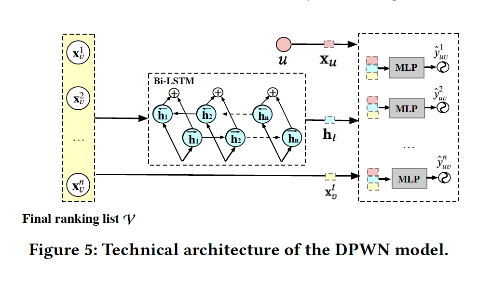

## 引言

首先，作者整体介绍了重排的常见做法， 包括point-wise,list-wise等方法

- point-wise: user-item pairs建模，纯贪心。
- list-wise: 主要包括以下三步
    - Ranking: the initial list is generated according to scores of the basic ranking model;
    - Refining: the list-wise feature distribution of the initial list is extracted by a well-designed module (e.g., LSTM [1] and self-attention [25, 26]) to refine the rating scores;
    - Re-ranking: candidate items are re-ranked by the refined list-wise rating scores **in the greedy manner**.
    - Overall, existing list-wise methods achieve improvements in recommendations mainly by modeling list-wise
feature distribution to focus on refining the item’s rating scores.
     
point-wise ctr主要对用户和物品的喜好进行建模，lise-wise refining ctr在point-wise ctr基础上融合了上下文的信息进行建模，目前listwise的重心还是在对于listwise特征的建模上。但不管ctr如何建模，重排算法本身还是贪心的。鉴于此，当前重排的做法不可能找到多序列视角下的最优解，因为目前的做法根本就没有考虑到序列的因素。

其次，作者展示了在淘宝中的一个真实case来协助说明这个情况，我画了一个新图在下面：

我们直接看permutation-wise的部分，在生成P2-Sequence的时候，第二步，选取了一个分数较小的文章，没有做贪心选择。然后Refining，此时C这篇文章拿到一个意向不到的高分，从而导致整个序列的分数大于前一个序列。如果只是listwise的方式，显然不会有出这个更优的序列。(作者从购物的角度给了一个合理的解释，即把贵的东西放到前面，可能会促成用户购买相对便宜的物品)

紧接着，作者说到以往的实践中未将序列因素考虑进去主要是有一些两个原因
- Exponential solutions. 序列生成是指数时间复杂度，没法落地。
- Permutation-wise evaluation. 现在对于ctr的建模都是依赖user-item interaction，没有对序列进行建模的方式。

最后，作者基于permutation-wise，尝试解决上面的这两个问题，提出了如下的prs框架。其中，PMatch用来解决序列生成的问题，PRank用来解决序列生成的问题。

## 核心思想

整体架构如下

- Permutation-Matching (PMatch): 这个用来进行序列生成。
    - 基于beam-search，考虑了多序列变量
    - 高效，显著的降低了时间复杂度，让多序列生成变成可行。
- Permutation-Ranking (PRank):这个用来进行序列评估
    - 提出一种统一对序列进行建模的办法。(a unified permutation-wise ranking criterion named LR metric)
    - 评估完成后，选择lr metric分数最高的序列，作为最终的推荐结果。

### PMatch

离线这里，主要是训练了两个point-wise打分模型

- the CTR prediction model $M^{CTR}$
- the NEXT prediction model $M^{NEXT}$

关于NEXT Score作者给出如下解释
>we first design the NEXT score, which predicts the probability whether the user will continue browsing after the item. Items with higher NEXT scores can increase the user’s desire for continuous browsing, which improves the probability of subsequent items being browsed and clicked.

在线这里，作者提出了一个FPSA算法，这个算法本身没什么好说的，其内部就是beam-search的实现，这里主要看下如何结合上面两个分数，选择top k的序列。作者给出了如下的评估公式：

这一组公式理解的一个基本思路来自于上面的next score，即我们要明白作者设计这个分数的意义在哪里？简单说，就是要把上下文因素放进来。我们对于某一篇文章是否消费，一方面取决于我们和这篇文章的相关性，即这篇文章我是否感兴趣。另一方面也取决于这篇文章出现在怎样的一个上下文当中。比如，我喜欢看nba，如果某一篇nba文章上面已经有好几篇nba相关的文章，并且我都消费了，那么这篇nba相关的文章我可能选择不看，因为之前看够了。如果这篇之前一篇nba相关的都没有，那我就有极大的可能消费这篇文章。

说回公式

- $p^{expose}$: 这个可以理解为上下文影响因素，我们对每一篇是否消费，都是在一个上下文环境中决定，那么这因素由它给出。
    - 这个值初始化为1，即第一篇文章，没有能影响它的，就看它本身的质量。
    - 每当某一位置，消费了某一篇文章，那么形成了所谓的行为上下文。
    - 此时，需要next score去更新这个分数。
- $r^{IPV}$: 这个公式可以理解为，对于每一篇文章的分数，在上下文环境下的修正。
    - 这个值初始化为0
    - 每一次修正文章的分数，然后累加。最终形成整个序列的item page view sum
- $r^{PV}$: 这个公式类似，只不过修正的是每一篇文章的next score
- $r^{sum}$: 这个是融合后的一个序列分数，最后用来评估序列效果。
    - 注意区分这里和prank的区别。

真个FPSA的算法流程如下：
- step1: 初始化，获取每一篇文章的ctr score/next score
- step2: beam search
    - expand sequences
    - select top k sequence based on Estimated-Reward
- step3: 拿到最后的待选序列

最后，再强调下PMatch的核心做法
- 使用了beam-search而不是greedy search，这保证了每一步的选择不是贪心选择。
- 同时，提供了序列评估的方法，保证选出k个还不错的待选序列。

### PRank

离线这里，作者提出了Deep Permutation-Wise Network model，主要用来对最终文章列表当中的序列因素进行捕捉和建模。具体结构如下：

作者特别强调到，dpwn和传统的list-wise model最大的区别在于，前者是对于最终的文章列表进行建模，而后者是对于整个ranking的输入文章列表进行建模。

在线这里，作者提出了统一的list reward评估方法，借助dpwn模型，对这个列表进行分数评估，公式如下:

PRank在PMatch产生序列的基础上，选出分数最高的序列，作为最终的返回结果。

## 一些架构上的思考

上面是论文的部分，下面是我的一些私货。其实看这篇文章的起因是，最近在帮算法同学迁移这个东西，发现了目前架构中一些不适配的地方，或者说做的不好的地方。尤其是目前prs的做法在各个bg已经是主流的做法，所以怎么更好的适配，协助算法同学高效的开发，变成了新的挑战。

重温了这篇论文之后，一个非常清晰的思路在我脑海中形成，这个就是rerank本质是一组search算法的结合。我们一路从exhausive search, point-wise greedy search，list-wise greedy search，融合diversity search的做法走过来，再到现在的beam-search，已经非常明显了。无论如何，这里就是各种search，你可以改良各种search算法，也可以加prank这样的流程，但是n2k这个过程，一定是会依赖search算法的。想到这一点之后，我就认为，目前的重排过程，可以朝着尝试把各种searcher抽出来的方式去试一试。当然，这个东西我觉得不见得会提升性能，主要是这里的代码需要治理。并且，各种searcher怎么能更好的和规则融合到一起，也就具有挑战性的工作。明天可以尝试做一下吧。
