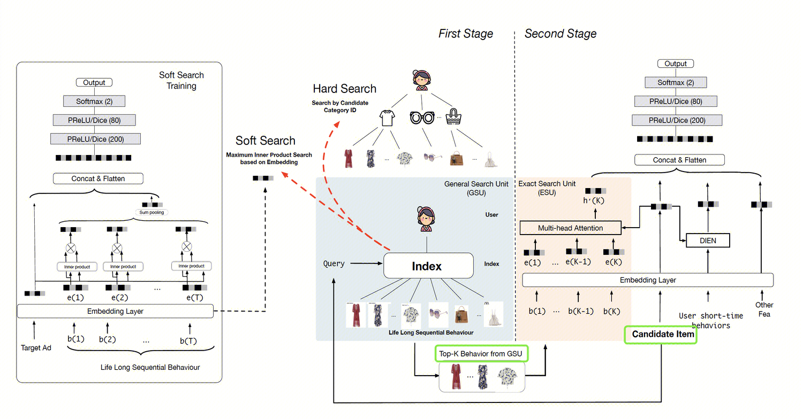
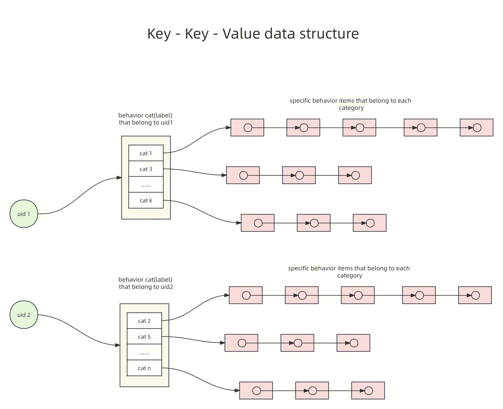
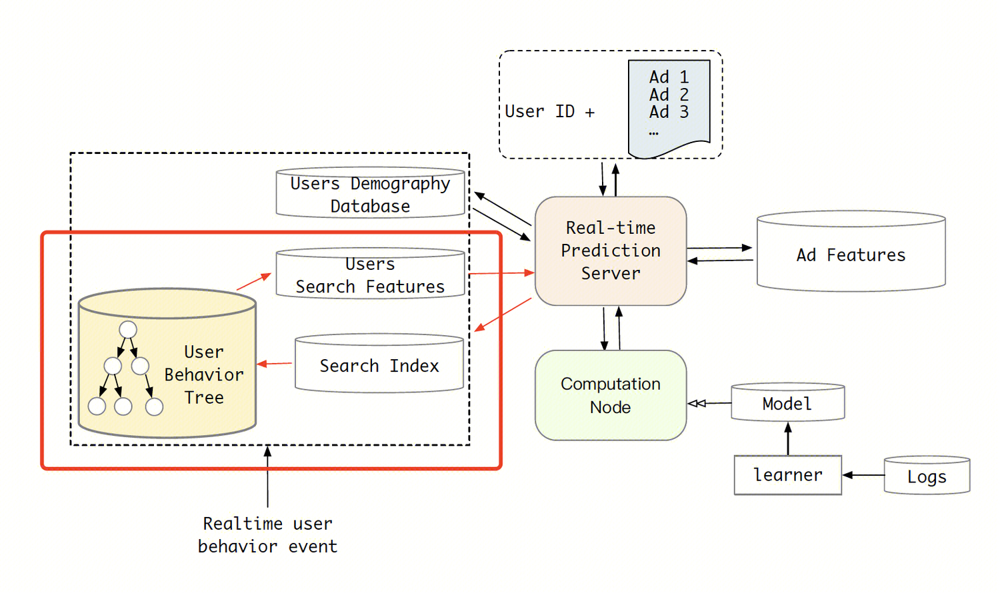
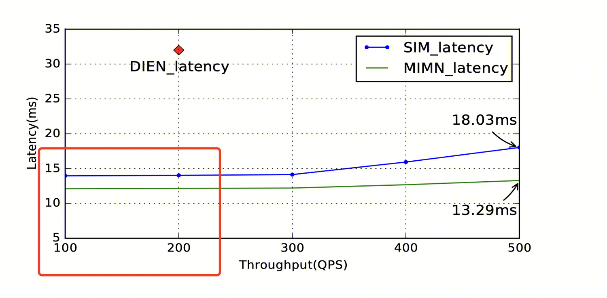

## Background

简单看了下论文：[SIM](https://arxiv.org/pdf/2006.05639.pdf) 

哲思：你看过的东西，决定了你是什么样的人。所以到底什么能代表你呢？自然是你看过的东西。

### Introduction

- MIMN: incrementally embeds diverse interest of one user into a fixed size memory matrix
	- pro: for online serving, latency will not be a problem and the storage cost depends on the size of the memory matrix which is much less than the raw behavior sequence.
	- con: encoding all user historical behaviors into a fixed size memory matrix causes massive noise to be contained in the memory units

我自己理解这个模型最大的优点是工程可行，但缺点是从用户历史中提取信息的方式并不高效，编码所有用户历史行为带来的问题就是噪声

- DIN
	- bias: the interest of one user is diverse and varies when facing different candidate item
	- ideas: The key idea of DIN is searching the effective information from user behaviors to model special interest of user, facing different candidate items.

DIN 我觉得做的更细化，当然它的思路也非常朴素，你看过的不同文章里，自然包含了你不同的兴趣。所以，在不同的文章里，对特定的兴趣进行建模是 DIN 的核心思路。

DIN 也有问题，就是计算量和存储不可接受。

总结：长序列建模的核心问题是：a more efficient way to extract knowledge from the long sequential user behavior data.

这其中efficient我觉得有两个方面，第一是工程可接受，第二是建模的准确性。

SIM 的思路如下，也是一个尝试多阶段级联解决问题的方式，类似 PRS，

- GSU: with query information from candidate item, gets a Sub user Behavior Sequence (SBS) which is relevant to candidate item
- ESU: *models the precise relationship between the candidate* models the precise relationship between the candidate item and SBS. Here we can

仔细看，做了啥事呢？是不是和 PMatch/PRank 如初一撤。哈哈😄

### SIM Model

- GSU
	- Given a candiGiven a candidate item (the target item to be scored by CTR model),
only a part of user behaviors are valuable.
	- This part of user behaviors are closely related to final user decision.
	- Picking out these relevant user behaviors is helpful in user interest modeling.
- ESU
	- top k related sub user behavior sequence 
	- the time intervals between target item and selected K user behaviors are used to provide temporal distance information.
	

注意，GSU 这里强我认为用 2/8定理理解比较合适，海量的用户消费历史，都是有用的吗？如果我们要对某一篇文章打分，是不是应该把最能建模用户的文章找出来，用这部分建模信息再给到candidate item去打分。图上还是比较清楚。选了TOP K出来。

### Online Serving

首先的一个点关于hard search 和 soft search的选择，作者最终选择了hard search，原因在于兼顾了性能收益和资源消耗。

关于hard search key的选择：

- the index which contains all the long sequential behavior data is a key component.
- we observe that behaviors can be achieved naturally by the category they belong
to.

这个第二点很重要，为什么分类可以当这个key? 有如下两点解释：
- 我们知道机器学习的底层是数理统计，其基本原理是：相似的数据具有相似的标签。
- 论文中也提到了这一点：In e-commerce website, items belong to the
same category are similar in most cases

We observee that behaviors can be achieved naturally by the category they belong to.

最终的结果就是，行为通过消费文章的类别来进行建模了。

#### UBT(User Behavior Tree)

- the first key: user id
- the second key: category ids 
- the last values: specific behavior data item that belong to each category

UBT就是对于用户长序列建模的数据结构，这个是核心。这个数据结构的设计(建模)基于hard search的思路。

这个我们得倒着看，每个用户的behavior items，通过cat(label)建立倒排。然后在根据uid关联到cat上，这一步是一个正排。

#### Hard Search

示意图如下：

- We take the category of target item as out hand-search query.
- After hard search, the length of user behaviors(items) could be reduced from over ten thousands to hundred.
- Thus the storage pressure of lifelong behaviors in online system could be released.

整个长序列的模型是UBT，对于每一次请求来说。
- uid充当第一级key
- target item中的category充当第二级key
- 从而对用户的行为历史做了精准匹配。当然，匹配的根据还是来自于上面说的，相似的内容具有相似的标签。

整个架构如下：

- Search Index: uid + target item labels(categorys)
- UBT: forward index + inverted index
- Users Search Features: TOP K behavior

### Experiments

- Samples from the past 49 days.
- Behaviors sequences: preceding 180 days.
- Over 30% of samples contain seq behavior data with a length of more than 10000.
- Maximum length of bs reaches up to 54000.

性能表现看起来不错。

对于实际工程部署，有一些注意点：

- Although the number of candidate items is hundreds, the number of categories of these items is usually less than 20.
- Meanwhile, the length of sub behavior sequence from GSU for each category is truncated by 200.

工程调优，二级key不超过 20，value长度不超过 200。减轻存储的压力，同时online serving searching的压力也会减少。

### Conclusion

说下我的心得

- Hard Search  的思路非常简单，但是非常管用。
- 背后是机器学习的底层原理：即数理统计，相似的数据具有相似的标签。
- 依据此，采用 K-K-V 的方式对长序列建模。
- 在线服务两阶段，非常通用的思路了，召回+精排。

## Our Implementation

- Offline
	- 序列长度：1000。图文视频保持一致。这个得到着来看，value的总长度是 1000，一级分类也不过 10 来个。平均下来，落地每一个user behavior cat的长度不到 100，这点和 UBT相比还是短了，UBT 做了截断，最长 200。当然，这是平均的计算，分类这里肯定也有头部效应。当然，这里还有一个注意点是，图文和视频是分开的。
	- 存储：并没有直接存储，这里统一落明文样本。所以，离线预处理UBT 的过程没有，是放到了在线。
- Online
	- Operator 1: UBT Generator.  
		- 根据user的user histoical items，将图文/视频存储在两个hash_map中。key 是cat1，在线构建UBT.
		- 同时，对于value做特征处理。
	- Operator 2: Hard Search.
		- 数量截断
		- 时间戳截断