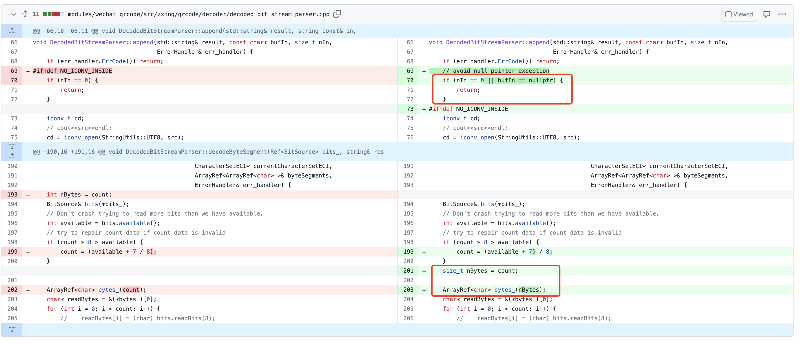

### 热情吃瓜

昨天上午因为一张二维码导致了微信的闪退，且稳定可复现，一时大家争相吃瓜。撇开这些，说说这次bug给我的一些启示。

### 展开说说

我不是微信的同学，所以他们排查的过程我无从而知，只说下最后排查的结果。
具体pr [fix(wechat_qrcode): Init nBytes after the count value is determined](https://github.com/opencv/opencv_contrib/pull/3480)

原因作者说的很清楚

> In DecodedBitStreamParser
::decodeByteSegment, an attacker can add a byte segment with the Character Count Indicator of non-zero but empty content at the end of the data segment, where available is 0 and count is updated to 0, but nBytes remains non-zero

```cpp
void DecodedBitStreamParser::decodeByteSegment(Ref<BitSource> bits_, string& result, int count,
                                               CharacterSetECI* currentCharacterSetECI,
                                               ArrayRef<ArrayRef<char> >& byteSegments,
                                               ErrorHandler& err_handler) {
    int nBytes = count;
    BitSource& bits(*bits_);
    // Don't crash trying to read more bits than we have available.
    int available = bits.available();
    // try to repair count data if count data is invalid
    if (count * 8 > available) {
        count = (available + 7 / 8);
    }

    ArrayRef<char> bytes_(count);
    char* readBytes = &(*bytes_)[0];
    ///......
    ///......
    append(result, readBytes, nBytes, err_handler);
}

void DecodedBitStreamParser::append(std::string& result, string const& in,
                                    ErrorHandler& err_handler) {
    append(result, (char const*)in.c_str(), in.length(), err_handler);
}

void DecodedBitStreamParser::append(std::string& result, const char* bufIn, size_t nIn,
                                    ErrorHandler& err_handler) {
    if (err_handler.ErrCode()) return;
#ifndef NO_ICONV_INSIDE
    if (nIn == 0) {
        return;
    }
    // ......
    result.append((const char*)bufIn, nIn);
}
```

- 首先，传递了empty ```bits_```，从而```available```为0.
- 其次，```coun```t在传递时，传递了非0的数值，严格来说没有和```bits_```的大小保持一致。
    - 导致，```nBytes```更新为非0数值。
    - 之后，```count```被```available```更新为0
- 紧接着，```bytes_```初始化的长度为0. ```readBytes```是一个```nullptr```
- 最后，调用```append```函数，注意
    - 此时```readBytes```是一个```nullptr```
    - ```nBytes```是一个非0的数值。不会提前返回，这就导致最终会调用```result.append((const char*)bufIn, nIn)```
    - 注意，带有三个参数的```append```，第二个参数是```string const& in```，**这里用一个nullptr去初始化一个std::string。导致了coredump**

我们看一下pr的作者对这个问题的看法:

>We think the essence of the issue is that count was modified without updating nBytes, resulting in inconsistent values for the two variables. Unlike #3479, we think that the initialization of nBytes should be done after the value of count has been determined, which helps avoid other potential errors.

乍一看这个修复思路，好像和我们的第一认知不一样。因为这个问题的罪魁祸首是```def nullptr```，其实对```nullptr```做一个校验就好。
我们看到```nullptr```的初始化其实是在这里```char* readBytes = &(*bytes_)[0];```，我们第一时间对这个指针变量做校验，非法直接返回即可。或者我们在构造```bytes```的时候，直接判断```count```的大小，看是否能构造出有效的```bytes```即可，为什么会用如上的方式进行修复。

这个还是得回到接口语义来说
```cpp
void DecodedBitStreamParser::append(std::string& result, const char* bufIn, size_t nIn,
                                    ErrorHandler& err_handler);
```

从这个接口来看，```bufIn```给出数组首地址，```nIn```给出数组大小，这是非常经典的c-style数组遍历
```cpp
for (int i = 0; i < nIn; ++i) {
    do_something_with(bufIn[i]);
}
```

所以，即使```bufIn```给出nullptr，但是```nIn```可以给出正确的数组大小，比如0，这里一样不会有问题。

这个pr也是类似的思路，代码修改者认为，虽然是空指针导致了最终的问题，但本质是数组的大小传错了，如果数组大小的传递是正确的，那么这个bug一样会避免。因为代码里对于非法的数组大小是做了处理的。

所以，最终的改动如下图


- 作者首先修复了```nBytes```的初始化逻辑错误，此时```nBytes```的大小和count对应，都是0。任然出构造出```nullptr```，但是下面的判断会避免进一步的```nullptr dereference```
- 其次，作者更谨慎一点，还加了对于```nullptr```的检验，其实单就本例来说，不用了。这个pr刚开始也没有加这个校验，后来加进来了。

#### 一些启示

- 对于c-style string和c++-style string尽量还是不要混用，本质不是一个东西。
- 关于代码校验的时机
    - 个人理解最底层的实现，应该还是不加的，这里要维持住zero of overhead.
    - 上层caller需要在合适的时机加上校验，简单说可以是最内部实现的外面第一层。
    - 因为从上面的代码来看，最底层，最上层都没有校验，加在了最底层的上面一层，这个我认为是合理的。