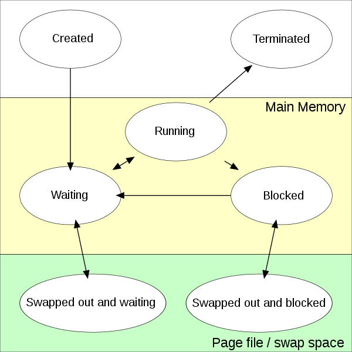

### 同步/异步/阻塞/非阻塞

这几个概念容易搞混，主要是因为没有限定好讨论问题的背景，当本文讨论这几个概念时，一定是在如下的背景
- Socket programming
- I/O model
- Function call

#### 同步/异步

microsoft从file I/O的角度给出了定义
>In synchronous file I/O, a thread starts an I/O operation and immediately enters a wait state until the I/O request has completed. A thread performing asynchronous file I/O sends an I/O request to the kernel by calling an appropriate function. If the request is accepted by the kernel, the calling thread continues processing another job until the kernel signals to the thread that the I/O operation is complete. It then interrupts its current job and processes the data from the I/O operation as necessary.

从时空角度来看
- 同步IO(Sequential IO)
  - 时间：线性
  - 空间：连续
- 异步IO(Non-sequential IO)
  - 时间：非线性
  - 空间：非连续

这里面时空是否线性，连续，时区分二者的根本原因。


#### 阻塞/非阻塞

这是对进程状态的描述，一个进程在任何一个时刻，只能处在以下一种状态
- Created
- Ready
- Running
  - kernel mode
  - user mode
- Blocked
- Terminated



很明显，以上的两组概念相互独立。他们是怎么结合起来的呢？这是因为file io/network io function call通常会导致process处在blocked state，所以为了更好的利用处理机资源，这里做了一些融合。
再次提醒本文讨论的背景，一定是低速的io操作，才涉及以上两组概念的结合

#### 同步阻塞

```cpp
ssize_t read(int fd, void *buf, size_t count);
```

- 同步
  - 函数不会立即返回，直到读操作结束
  - 时间连续
- 阻塞
  - 当前函数调用，会阻塞线程

#### 同步非阻塞

```cpp
make_socket_nonblocking(fd);
void io_read_n(int fd, char buf[], int n) {
  int total = 0;
  while(total < n) {
    int nread = read(fd, buf+total, n - total);
    if (nread == -1) {
      if (errno == EINTR)
        nread = 0;
      else
        return;
    }
    else if (nread == 0)
      break;

    total += nread;
  }
```

- 同步
  - read函数立即返回，能读多少字节读多少字节。
  - 但是io_read_n直到读够N个字节才返回。我们可以这么理解，read函数是异步的，但是io_read_n是一个同步函数
  - 时间连续，不做完一件事，不会去做下一件事
  - 底层函数是异步的，但是可以用一个同步函数去封装它，对外提供同步接口。这种操作在socket programming中非常常见，multiplexing就是非常典型的同步接口封装异步接口的例子
- 非阻塞
  - 当前函数调用并不会阻塞线程

同步非阻塞好于同步阻塞的地方在于，线程不会发生调度。但是，线程存在polling

#### 异步非阻塞

异步非阻塞在同步阻塞的基础上，进一步释放线程的能力，避免线程polling的出现。

```js
fs.readFile(filename, (err, data) => {
  if (err) {
    // handle |err|
  }
  // use |data|
});
console.log('start file I/O, and continue');
```

- 异步
  - readFile函数立即返回。此时读取可能没有完成，但是会去做下一件事
  - 读取完成后，通过回调执行对应的操作。
  - 时间不连续，不做完一件事，可以去做下一件事
  - 需要语言/系统支持 注册回调机制
- 非阻塞
  - 当前函数调用不会阻塞线程

异步非阻塞的好处时，线程不阻塞，不触发调度。异步增强cpu效率，单位时间内能做更多的事情。但缺点是，代码难写。

我们可以再看一个例子，主进程回收子进程，可以采用同步阻塞，同步非阻塞的方式。下面给出了异步非阻塞的方式
- os支持注册回调机制
  - 主进程刚进入函数向os注册对应的event和event_handler
  - os会判断如果对应的event发生(os如何判断，这里不展开)，调用event_handler进行对应的操作
- 主进程此时不用回收完子进程，再继续执行。不等，不阻塞
```cpp
#include <stdio.h>
#include <sys/wait.h>
#include <unistd.h>
#include <signal.h>

void child_handler(int sig) {
  printf("%d events happend.\n", sig);

  int status = 0;
  pid_t child_pid = waitpid(-1, &status, WNOHANG);

  if (WIFEXITED(status)) {
    printf("Remove child: %d.\n", child_pid);
    printf("Child send: %d.\n", status);
  }
}

void do_something(int& counter) {
  printf("Parent: do something.\n");
  counter += 5;
}

void register_event() {
  struct sigaction action;
  action.sa_handler = &child_handler;
  action.sa_flags = 0;
  sigemptyset(&action.sa_mask);

  sigaction(SIGCHLD, &action, NULL);
}

int child_routine() {
  printf("I am child process.\n");
  printf("Child Ends.\n");
  return 100;
}

int parent_routine() {
  int counter = 0;
  while(true) {
    do_something(counter);
    if (counter > 10) {
      break;
    }
  }
  printf("Parent Ends\n");
  return 0;
}

int main(void) {
  register_event();

  pid_t pid = fork();
  if (pid == 0) {
    return child_routine();
  } else {
    return parent_routine();
  }
}
```

#### 异步阻塞

上文提到，异步非阻塞已经比较高效，但是它有一个问题就是回调不好写。因为时空非连续，所以当回调嵌套层次较深之后，很难判断当前到底处在一个什么时间点，该做什么事。也即会导致[callback cell](http://callbackhell.com/)

虽说异步非阻塞效率高，但是大家逐渐意识到，需要做一些tradeoff，来保证代码开发的效率。trpc/fiber, brpc/bthread均采用了类似的思路来支持[application threads](https://github.com/facebook/folly/tree/master/folly/fibers)

```js
// Node.js 用 util.promisify 封装 fs.readFile() 接口
// io model惯用的手法，用一个异步阻塞接口来封装一个异步非阻塞接口
const readFileAsync = util.promisify(fs.readFile);

try {
  const data = await readFileAsync(filename);
  // use |data|
} catch (err) {
  // handle |err|
}
```

- 需要系统/语言支持coroutine
- 阻塞
  - readFileAsync发起IO请求，阻塞到IO结束。
  - 注意，这里阻塞的时coroutine
- 异步
  - 某一个coroutine阻塞，此时线程会调度其他coroutine执行
  - 从线程角度来看，时间非连续。在不支持coroutine时，线程这里只能同步
- 本质上
  - [cooperative multitasking](https://en.wikipedia.org/wiki/Cooperative_multitasking)这里有一个非常大的特性，cpu操作，不抢占，让出。同步语义好写
  - botman认为这里没有race condition，这里我理解如果是M:1线程模型，那应该没有问题。因为这里本质是在一个线程里协作，coroutine在线程中并发执行，没有并行
  - 但是M:N模型，肯定是不行，一个线程可能会跑不同任务的coroutine，不同任务之间存在data race.
- 优势
  - 开发易。代码好写，写的是阻塞代码
  - 更简单。no data race，当然这里时M:1线程模型
  - 开销小。no system call.
  - 更高效。更多任务被执行。异步的优点

[从时空维度看 I/O 模型](https://bot-man-jl.github.io/articles/?post=2019/IO-Models)<br>
[bthread](https://github.com/apache/incubator-brpc/blob/master/docs/cn/bthread.md)<br>
[常见线程模型](https://github.com/apache/incubator-brpc/blob/master/docs/cn/threading_overview.md)<br>