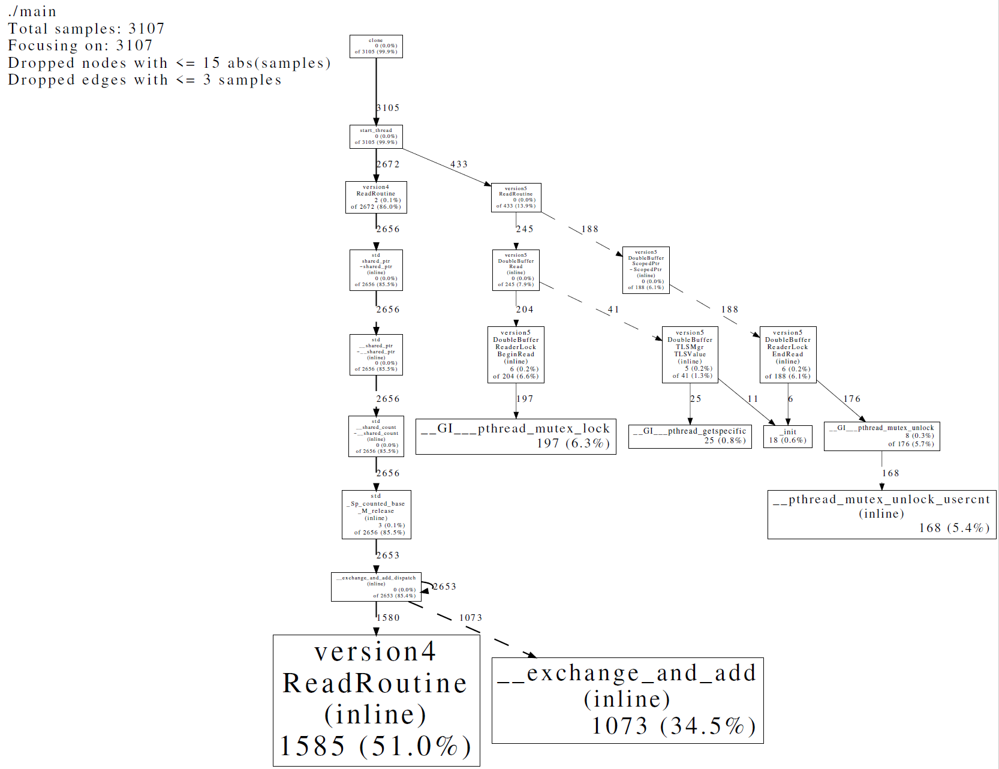
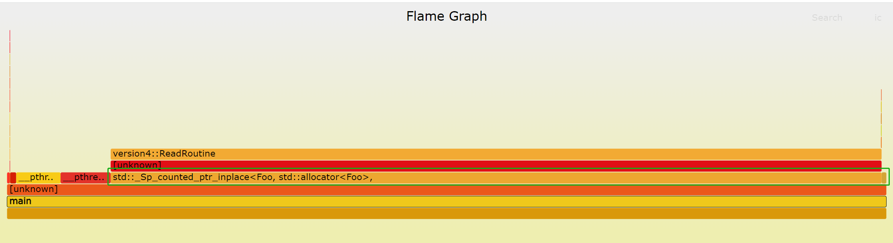

最近看了下brpc dbd(DoublyBufferedData)的实现，感叹其设计的精妙，同时回顾我们自己使用的dbd以及网上一些其余的错误做法，希望对各种实现做一个的简单对比，让大家了解各种版本的差异。

## 引子

对于大并发环境下少写多读(读远大于写)的场景，使用dbd来优化性能，本质是空间换时间，降低锁的竞争。LoadBalancer以及reload dict都是高频使用场景。其基本思路如下：

- 数据分读面/写面
- 读线程只读读面
- 写线程修改写面，修改之后需要切换读面/写面
- 读面/写面切换需要保证atomic.

以上只是一个基本思路，是否能保证高效和正确性，需要看具体的实现

## version1

```cpp
template<typename T>
class DoubleBuffer {
 public:
  DoubleBuffer() = default;

  DoubleBuffer(const DoubleBuffer&) = delete;
  DoubleBuffer& operator=(const DoubleBuffer&) = delete;

  const T* Read() const { return data_ + index_; }

  void Write(const T& new_val) {
    int new_index = !index_;
    data_[new_index] = new_val;

    index_ = new_index;
  }

 private:
  T data_[2];
  std::atomic<int> index_{0};
};
```

- 读/写面开在数组中
- 读面标识(index_)通过std::atomic<T>保证其更新的原子性

但是这个版本并不是线程安全的，考虑如下情形
- 某一个时刻index_为0，此时来了一个reader，进行数据读取(操作data_[0])
- 同时，来了一个writer，更新数据(操作data_[1])，数据更新完毕后，更换读写面，此时index_为1
- 下一个时刻，又来了一个writer，此时更新数据(操作data_[0])，但是刚才的reader还没有读取完毕，即data_[0]有reader在读。此时发生data race

发生问题的关键在于，writer无法获知当读面更新后，老的读面是否还有reader在进行读取。所以，如果要保证线程安全的读写，必须有对应的同步机制。

## version2

```cpp
template<typename T>
class DoubleBuffer {
 public:
  DoubleBuffer() = default;

  DoubleBuffer(const DoubleBuffer&) = delete;
  DoubleBuffer& operator=(const DoubleBuffer&) = delete;

  const T* Read() const { return data_ + index_; }

  void Write(const T& new_val) {
    int new_index = !index_;
    data_[new_index] = new_val;

    index_ = new_index;

    // sleep for a while
    sleep(1);
  }

 private:
  T data_[2];
  std::atomic<int> index_{0};
};
```

当前版本做了一个改进，即在writer更新玩之后，sleep for a while，用来等待老的读者读取完毕。按照chenshuo的观点，线程之间的同步机制，无论如何都不能依赖sleep这样的方式，因为理论上这无法保证绝对的线程安全。我们看下brpc作者对这种方法的论述：

>这个方法的问题在于它假定睡眠一段时间后就能避免和前台读线程发生竞争，这个时间一般是若干秒。由于多次写之间有间隔，这儿的写往往是批量写入，睡眠时正好用于积累数据增量。
但这套机制对“server列表”不太好用：总不能插入一个server就得等几秒钟才能插入下一个吧，即使我们用批量插入，这个"冷却"间隔多少会让用户觉得疑惑：短了担心安全性，长了觉得没有必要。我们能尽量降低这个时间并使其安全么？

所以这个办法任然不够完美。

## version3

下面介绍我们自己用的办法。上面做法产生读/写数据竞争的根本问题在于，读写两个面来回切换，复用了内存。所以，只要我们不复用内存，就不存在读写的竞争，本质还是空间换时间。具体来说，每次新写的数据开在heap上，reader数据的生命周期由smart pointer负责跟踪。

```cpp
template<typename T>
class DoubleBuffer {
 public:
  DoubleBuffer() {
    for (int i = 0 ; i < 2; ++i) {
      data_[i] = std::make_shared<T>();
    }
  }

  DoubleBuffer(const DoubleBuffer&) = delete;
  DoubleBuffer& operator=(const DoubleBuffer&) = delete;

  std::shared_ptr<T> Read() const { return data_[index_]; }

  void Write(const T& new_val) {
    std::shared_ptr<Foo> new_ptr = std::make_shared<Foo>(new_val);
    int new_index = !index_;
    data_[new_index] = new_ptr;

    index_ = new_index;
  }

 private:
  std::shared_ptr<T> data_[2];
  std::atomic<int> index_{0};
};
```

- 读/面写面开在heap上，由shared_ptr管理
- 双buffer数组保存shared_ptr，不直接管理数据。

## version4

这个版本我们显示的指定了memory_order，没有使用默认的(使用默认的对正确性并没有影响)

```
template<typename T>
class DoubleBuffer {
 public:
  DoubleBuffer() {
    for (int i = 0 ; i < 2; ++i) {
      data_[i] = std::make_shared<T>();
    }
  }

  DoubleBuffer(const DoubleBuffer&) = delete;
  DoubleBuffer& operator=(const DoubleBuffer&) = delete;

  std::shared_ptr<T> Read() const {
    int cur_index = index_.load(std::memory_order_acquire);
    return data_[cur_index];
  }

  void Write(const T& new_val) {
    std::shared_ptr<Foo> new_ptr = std::make_shared<Foo>(new_val);
    int new_index = !index_.load(std::memory_order_relaxed);
    data_[new_index] = new_ptr;

    index_.store(new_index, std::memory_order_release);
  }

 private:
  std::shared_ptr<T> data_[2];
  std::atomic<int> index_{0};
};
```

## version5

回过头来，我们再看brpc的实现，还是在version2的基础上进行改进。要解决的还是同一个问题，即writer需要知道老reader都读取结束之后，再进行写，核心是设计这里的同步机制。具体做法如下：

- 读拿一把thread-local锁，执行查询逻辑后释放锁
- 同时只有一个写：修改后台数据，切换前后台，挨个获得所有thread-local锁并立刻释放，结束后再改一遍新后台（老前台）

其基本原理如下：
- 当一个读正在发生时，它会拿着所在线程的thread-local锁，这把锁会挡住同时进行的写，从而保证前台数据不会被修改。
- 在大部分时候thread-local锁都没有竞争，对性能影响很小。
- 逐个获取thread-local锁并立刻释放是为了确保对应的读线程看到了切换后的新前台。如果所有的读线程都看到了新前台，写线程便可以安全地修改老前台（新后台）了。

说下这个实现打动我的地方：
- 首先，thread local锁，降低了锁的力度。读-读没有竞争
- 其次，写需要等所有老读者结束，这个同步机制本质是等待语义。我们知道锁实现的是互斥语义，条件变量实现的的等待语义。这里巧妙的用锁实现了等待语义（即等所有老读者读完这个条件发生）
- 最后，锁对性能的真正的影响在于竞争，如果只是简单的拿锁，释放锁，开销是很低的。brpc文档里面说了大概是25ns左右，所以看似每次读都要加锁，但其实对性能没什么影响。

下面看下代码，原始brpc dbd实现的功能非常完备，不适合快速阅读，我简化了brpc的实现，适合分享给大家

```cpp
template<typename T>
class DoubleBuffer {
  class ReaderLock;
  class TLSMgr;
 public:
  class ScopedPtr;
  DoubleBuffer() : tls_mgr_(this) {}

  void Read(ScopedPtr* ptr);
  void Write(const T& new_val);

 private:
  const T* UnsafeRead() const;
  void AddReaderLock(ReaderLock* reader_lock);
  void RemoveReaderLock(ReaderLock* reader_lock);

 private:
  T data_[2];
  std::atomic<int> index_{0};
  mymuduo::MutexLock modify_mtx_;  // Sequence modification
  mymuduo::MutexLock list_mtx_;  // Sequence assess to reader_lock_list
  std::vector<ReaderLock*> reader_lock_list_;
  TLSMgr tls_mgr_;
};

template<typename T>
class DoubleBuffer<T>::ReaderLock {
 public:
  explicit ReaderLock(DoubleBuffer* db) : db_(db) {
    MCHECK(pthread_mutex_init(&mtx_, NULL));
  }

  ReaderLock(const ReaderLock&) = delete;
  ReaderLock& operator=(const ReaderLock&) = delete;

  ~ReaderLock() {
    if (db_) {
      db_->RemoveReaderLock(this);
    }
    MCHECK(pthread_mutex_destroy(&mtx_));
  }

  void BeginRead() { MCHECK(pthread_mutex_lock(&mtx_)); }
  void EndRead() { MCHECK(pthread_mutex_unlock(&mtx_)); }
  void WaitReadDone() { BeginRead(); EndRead(); }

 private:
  DoubleBuffer* db_;
  pthread_mutex_t mtx_;
};

template<typename T>
class DoubleBuffer<T>::TLSMgr {
 public:
  explicit TLSMgr(DoubleBuffer* db) : db_(db) {
    MCHECK(pthread_key_create(&pkey_, &dtor));
  }

  TLSMgr(const TLSMgr&) = delete;
  TLSMgr& operator=(const TLSMgr&) = delete;

  ~TLSMgr() { MCHECK(pthread_key_delete(pkey_)); }

  ReaderLock* TLSValue() {
    ReaderLock* tls_reader_lock = static_cast<ReaderLock*>(pthread_getspecific(pkey_));
    if (tls_reader_lock) {
      return tls_reader_lock;
    }

    std::unique_ptr<ReaderLock> new_tls_reader_lock(new (std::nothrow) ReaderLock(db_));
    if (!new_tls_reader_lock) {
      return nullptr;
    }
    MCHECK(pthread_setspecific(pkey_, new_tls_reader_lock.get()));
    db_->AddReaderLock(new_tls_reader_lock.get());
    return new_tls_reader_lock.release();
  }

 private:
  static void dtor(void* x) {
    ReaderLock* val = static_cast<ReaderLock*>(x);
    delete val;
  }

 private:
  DoubleBuffer* db_;
  pthread_key_t pkey_;
};

template<typename T>
class DoubleBuffer<T>::ScopedPtr {
 public:
  ScopedPtr() = default;

  ScopedPtr(const ScopedPtr&) = delete;
  ScopedPtr& operator=(const ScopedPtr&) = delete;

  ~ScopedPtr() {
    if (reader_lock_) {
      reader_lock_->EndRead();
    }
  }

  const T* get() const { return data_; }
  const T& operator*() const { return *data_; }
  const T* operator->() const { return data_; }

 private:
  friend class DoubleBuffer;
  const T* data_{nullptr};
  ReaderLock* reader_lock_{nullptr};
};

template<typename T>
void DoubleBuffer<T>::Read(typename DoubleBuffer<T>::ScopedPtr* ptr) {
  auto* tls_reader_lock = tls_mgr_.TLSValue();
  if (!tls_reader_lock) {
    return;
  }

  tls_reader_lock->BeginRead();
  ptr->data_ = UnsafeRead();
  ptr->reader_lock_ = tls_reader_lock;
}

template<typename T>
void DoubleBuffer<T>::Write(const T& new_val) {
  mymuduo::MutexLockGuard modify_mtx_guard(modify_mtx_);

  int new_index = !index_.load(std::memory_order_relaxed);
  data_[new_index] = new_val;

  index_.store(new_index, std::memory_order_release);

  mymuduo::MutexLockGuard list_mtx_guard(list_mtx_);
  for (auto&& read_lock : reader_lock_list_) {
    read_lock->WaitReadDone();
  }
}

template<typename T>
const T* DoubleBuffer<T>::UnsafeRead() const {
  return data_ + index_.load(std::memory_order_acquire);
}

template<typename T>
void DoubleBuffer<T>::AddReaderLock(ReaderLock* reader_lock) {
  if (!reader_lock) {
    return;
  }
  mymuduo::MutexLockGuard list_mtx_guard(list_mtx_);
  reader_lock_list_.emplace_back(reader_lock);
}

template<typename T>
void DoubleBuffer<T>::RemoveReaderLock(ReaderLock* reader_lock) {
  if (!reader_lock) {
    return;
  }
  mymuduo::MutexLockGuard list_mtx_guard(list_mtx_);
  for(auto&& a_lock : reader_lock_list_) {
    if (a_lock == reader_lock) {
      a_lock = reader_lock_list_.back();
      reader_lock_list_.pop_back();
      return;
    }
  }
}
```

## 性能

针对version4和version5这两个版本，我们做一个简单的测试。模拟多读少写的情形，看下这两个版本的性能怎么样。测试方式如下：

- 8个reader，每个reader读1<<25次
- 1个writer，写一次。
- Intel(R) Core(TM) i7-7700 CPU @ 3.60GHz and 4 cores

计算的耗时如下：
- version4: almost 10000ms
- version5: almost 1200ms

刚看到这个结果的时候，我还是优点惊讶的，没想到我们自己的做法和brpc的差异这么大。具体又跑了perf看了下

cpu profiler如下



flame graph如下



所有的分析均指向了一点就是，shared_ptr的析构。我们再回过头看version3的实现：
- 读每次会拷贝shared_ptr，这里会有大量的ctor/dtor，造成了上图的开销
- 同时，shared_ptr虽然不会拷贝原来的数据，但是control block开在heap上，时间长了也会造成碎片的问题。
- 对于brpc::dbd，我一开始没有想到的就是加锁/解锁的开销会这么低，从某种程度上，我混淆了竞争的开销和加/解锁的开销，前者才是大头。